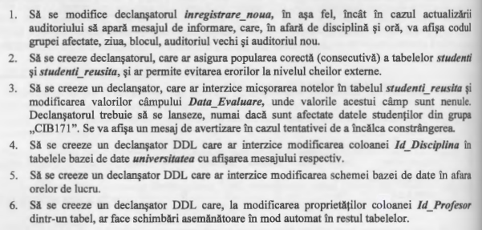
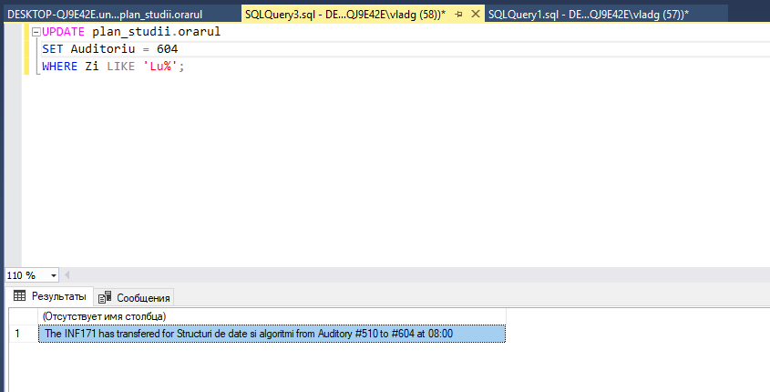
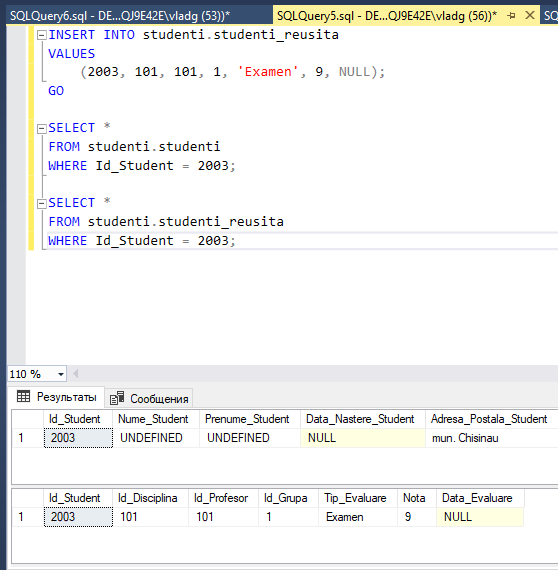
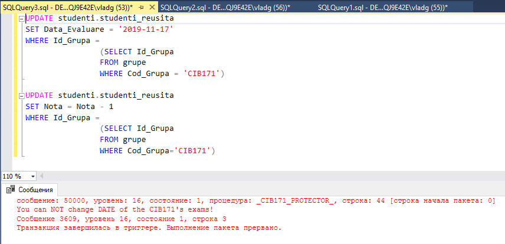
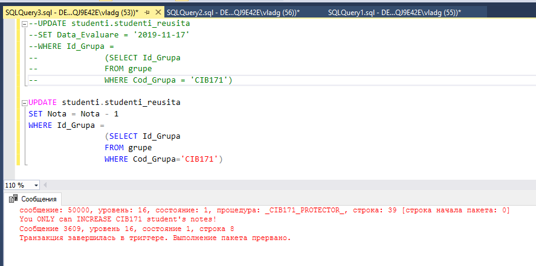
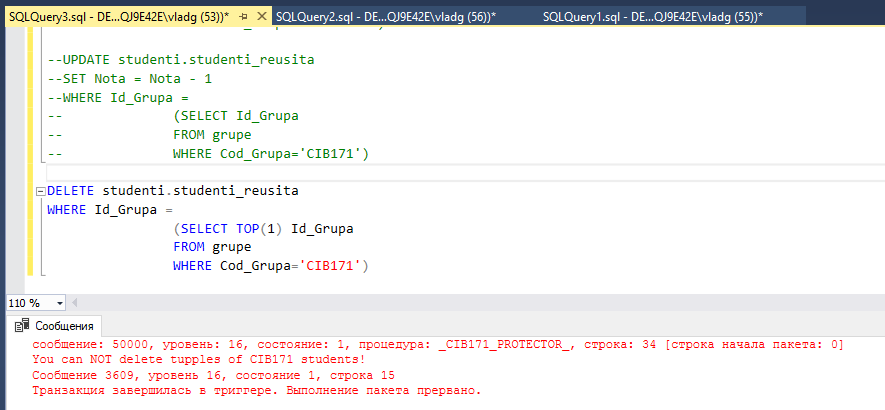
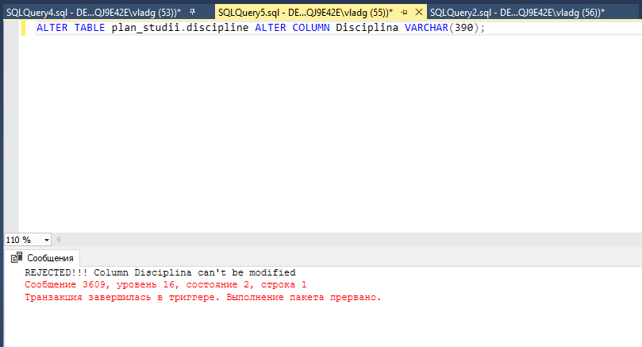
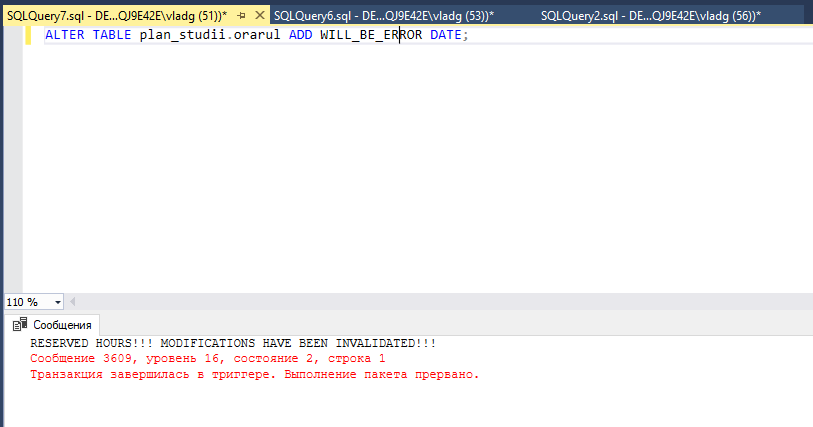
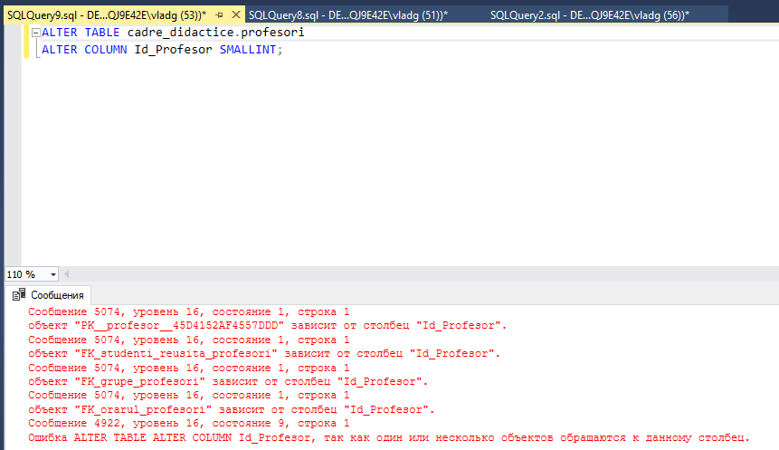

# Task



# Solutions

**1.** [Code:](Scripts/1.sql)

```SQL
DROP TRIGGER IF EXISTS [plan_studii].[new_registry]
GO

CREATE TRIGGER new_registry ON plan_studii.orarul
AFTER UPDATE
AS
	DECLARE @AUDITORIU_VECHI INT = 
								(SELECT deleted.Auditoriu
								FROM deleted)
	IF(UPDATE(Auditoriu))
	BEGIN
		SELECT 'The ' + Cod_Grupa + ' has transfered for ' + Disciplina + ' from Auditory #' + CAST(@AUDITORIU_VECHI AS VARCHAR(4)) + ' to #' + CAST(Auditoriu AS VARCHAR(4)) + ' at ' + CAST(Ora AS VARCHAR(5)) 
		FROM inserted
		JOIN grupe ON grupe.Id_Grupa = inserted.Id_Grupa
		JOIN discipline ON  discipline.Id_Disciplina = inserted.Id_Disciplina
	END
GO
```


**2.** [Code:](Scripts/2.sql)

```SQL
DROP TRIGGER IF EXISTS [studenti].[Studenti_StudentiReusita_Insertion]
GO

CREATE TRIGGER Studenti_StudentiReusita_Insertion ON studenti.studenti_reusita
INSTEAD OF INSERT
AS 
	SET NOCOUNT ON
	DECLARE @ID_STUDENT INT;
	DECLARE @NUME_STUDENT VARCHAR(50) = 'UNDEFINED';
	DECLARE @PRENUME_STUDENT VARCHAR(50) = 'UNDEFINED';
	DECLARE @DATA_NASTERE_STUDENT DATE = NULL;
	DECLARE @ADRESA_POSTALA_STUDENT VARCHAR(255) = 'mun. Chisinau';

	SELECT @ID_STUDENT = inserted.Id_Student
	FROM inserted;
	
	INSERT INTO studenti.studenti
	VALUES 
        (@ID_STUDENT, @NUME_STUDENT, @PRENUME_STUDENT, @DATA_NASTERE_STUDENT, @ADRESA_POSTALA_STUDENT);
	
	INSERT INTO studenti.studenti_reusita
	SELECT * 
	FROM inserted;
GO
```


**3.** [Code:](Scripts/3.sql)

```SQL
Use universitatea
Go

DROP TRIGGER IF EXISTS [studenti].[_CIB171_PROTECTOR_];
Go

CREATE TRIGGER _CIB171_PROTECTOR_ ON studenti.studenti_reusita
AFTER UPDATE, DELETE
AS
	DECLARE @NOTA_VECHE INT;  
		SELECT @NOTA_VECHE = d.Nota
		FROM deleted AS d INNER JOIN grupe AS g
		ON d.Id_Grupa = g.Id_Grupa
		WHERE Cod_Grupa LIKE 'CIB171';
	

	DECLARE @NOTA_NOUA INT;
		SELECT @NOTA_NOUA = i.Nota
		FROM inserted AS i INNER JOIN grupe AS g
		ON i.Id_Grupa = g.Id_Grupa
		WHERE Cod_Grupa LIKE 'CIB171';
	
	DECLARE @DATA_VECHE DATE;
		SELECT @DATA_VECHE = d.Data_Evaluare
		FROM deleted AS d INNER JOIN grupe AS g
		ON d.Id_Grupa = g.Id_Grupa
		WHERE Cod_Grupa LIKE 'CIB171';

	DECLARE @DATA_NOUA DATE; 
		SELECT @DATA_NOUA = i.Data_Evaluare
		FROM inserted AS i INNER JOIN grupe AS g
		ON i.Id_Grupa = g.Id_Grupa
		WHERE Cod_Grupa LIKE 'CIB171';
	

	IF @NOTA_NOUA IS NULL
		BEGIN
		ROLLBACK TRANSACTION;
		RAISERROR('You can NOT delete tupples of CIB171 students!', 16, 1);
		END;
	IF @NOTA_NOUA < @NOTA_VECHE
		BEGIN
		ROLLBACK TRANSACTION;
		RAISERROR('You ONLY can INCREASE CIB171 student''s notes!', 16, 1);
		END;
	IF @DATA_VECHE != @DATA_NOUA
		BEGIN
		ROLLBACK TRANSACTION;
		RAISERROR('You can NOT change DATE of the CIB171''s exams!', 16, 1);
		END;
```







**4.** [Code:](Scripts/3.sql)

```SQL
DROP TRIGGER IF EXISTS ATTRIBUTE_PROTECTOR ON Database
GO

CREATE TRIGGER ATTRIBUTE_PROTECTOR
ON DATABASE
FOR ALTER_TABLE
AS
	DECLARE @COLUMN_NAME VARCHAR(250);
	SELECT @COLUMN_NAME = EVENTDATA().value('(/EVENT_INSTANCE/AlterTableActionList/*/Columns/Name)[1]', 'nvarchar(100)') 
	
	IF @COLUMN_NAME LIKE 'Disciplina'
	BEGIN 
		PRINT ('REJECTED!!! Column ' + @COLUMN_NAME + ' can''t be modified')
		ROLLBACK;
	END
```



**5.** [Code:](Scripts/5.sql)

```SQL
DROP TRIGGER IF EXISTS SCHEME_PROTECTOR ON DATABASE;
GO

CREATE TRIGGER SCHEME_PROTECTOR
ON DATABASE
FOR ALTER_TABLE
AS
	DECLARE @START INT = 9 * 60 * 60;
	DECLARE @END INT = 20 * 60 * 60;

	DECLARE @DATE DATETIME = GETDATE();
	DECLARE @CURRENT_TIME INT = (DATEPART(HOUR, @DATE) * 60 * 60) +
								(DATEPART(MINUTE, @DATE) * 60) +
								(DATEPART(SECOND, @DATE));
	

	IF @CURRENT_TIME NOT BETWEEN @START AND @END
		BEGIN
		PRINT('RESERVED HOURS!!! MODIFICATIONS HAVE BEEN INVALIDATED!!!')
		ROLLBACK
		END;
```



**6.** [Code:](Scripts/5.sql)

```SQL
DROP TRIGGER IF EXISTS VERY_HARD ON DATABASE;
GO

CREATE TRIGGER VERY_HARD ON DATABASE
FOR ALTER_TABLE
AS SET NOCOUNT ON
	
	DECLARE @CHOSEN_ATTRIBUTE VARCHAR(50)
	SELECT @CHOSEN_ATTRIBUTE = EVENTDATA().value('(/EVENT_INSTANCE/AlterTableActionList/*/Columns/Name)[1]', 'nvarchar(100)');
	
	IF @CHOSEN_ATTRIBUTE = 'Id_Profesor'
		BEGIN
		
		DECLARE @TASK VARCHAR(50)
		SELECT @TASK = EVENTDATA().value('(/EVENT_INSTANCE/TSQLCommand/CommandText)[1]','nvarchar(max)') 
		
		DECLARE @INITIAL_TABLE VARCHAR(20)
		SELECT @INITIAL_TABLE = EVENTDATA().value('(/EVENT_INSTANCE/ObjectName)[1]','nvarchar(max)') 
		
		DECLARE @TASK1 VARCHAR(50);
		SELECT @TASK1 = REPLACE(@CHOSEN_ATTRIBUTE, @INITIAL_TABLE, 'profesori');
		
		DECLARE @TASK2 VARCHAR(50);
		SELECT @TASK2 = REPLACE(@CHOSEN_ATTRIBUTE, @INITIAL_TABLE, 'orarul');
		
		DECLARE @TASK3 VARCHAR(50)
		SELECT @TASK3 = REPLACE(@CHOSEN_ATTRIBUTE, @INITIAL_TABLE, 'studenti_reusita');
	
		EXECUTE (@TASK1)   
		EXECUTE (@TASK2)
		EXECUTE (@TASK3) 
	
		PRINT 'THE DATA HAS BEEN MODIFIED IN ALL THE TABLES!!!' 
		END;
```

