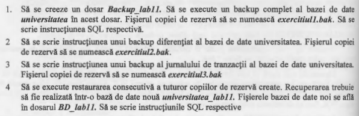
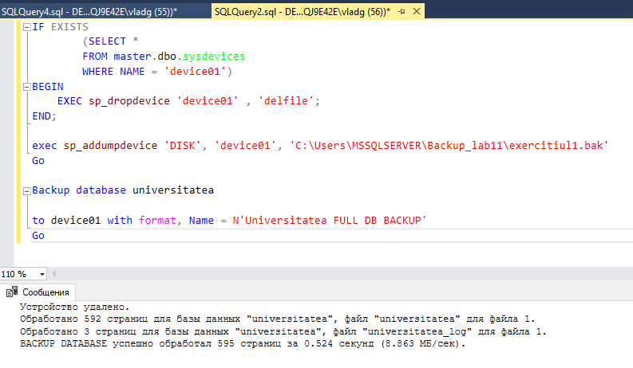
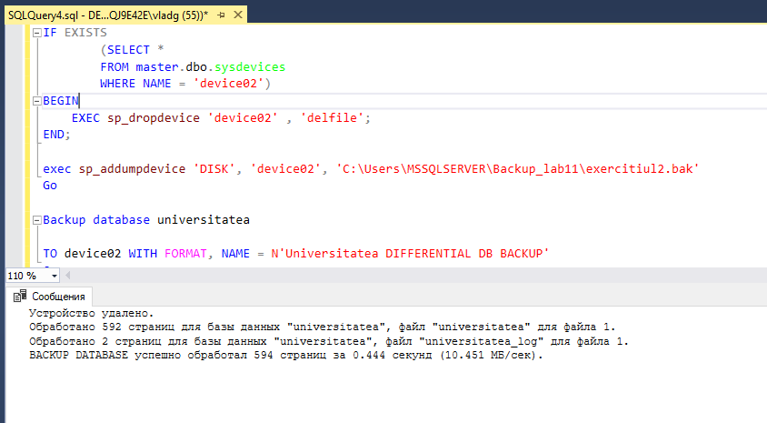
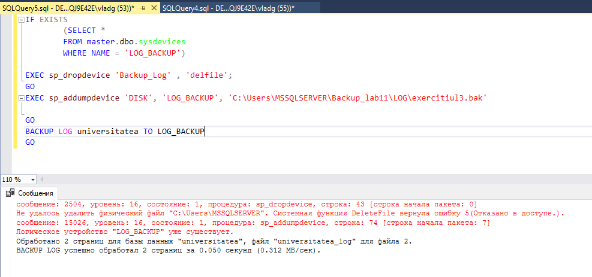
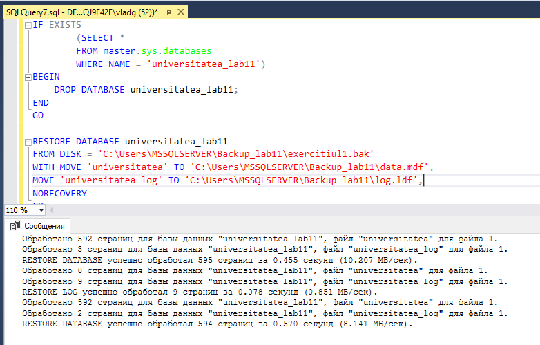

# Tasks



# Solutions

**1.** [Code:](Scripts/1.sql)

```SQL
IF EXISTS 
		(SELECT * 
		FROM master.dbo.sysdevices 
		WHERE NAME = 'device01')
BEGIN
	EXEC sp_dropdevice 'device01' , 'delfile';
END;

exec sp_addumpdevice 'DISK', 'device01', 'C:\Users\MSSQLSERVER\Backup_lab11\exercitiul1.bak'
Go

Backup database universitatea

to device01 with format, Name = N'Universitatea FULL DB BACKUP'
Go
```



**2.** [Code:](Scripts/2.sql)

```SQL
IF EXISTS 
		(SELECT * 
		FROM master.dbo.sysdevices 
		WHERE NAME = 'device02')
BEGIN
	EXEC sp_dropdevice 'device02' , 'delfile';
END;

exec sp_addumpdevice 'DISK', 'device02', 'C:\Users\MSSQLSERVER\Backup_lab11\exercitiul2.bak'
Go

Backup database universitatea

TO device02 WITH FORMAT, NAME = N'Universitatea DIFFERENTIAL DB BACKUP'
Go
```



**3.** [Code:](Scripts/3.sql)

```SQL
IF EXISTS 
		(SELECT * 
		FROM master.dbo.sysdevices 
		WHERE NAME = 'LOG_BACKUP')

EXEC sp_dropdevice 'Backup_Log' , 'delfile';
GO
EXEC sp_addumpdevice 'DISK', 'LOG_BACKUP', 'C:\Users\MSSQLSERVER\Backup_lab11\LOG\exercitiul3.bak'

GO
BACKUP LOG universitatea TO LOG_BACKUP
GO
```



**4.** [Code:](Scripts/4.sql)

```SQL
IF EXISTS 
		(SELECT * 
		FROM master.sys.databases 
		WHERE NAME = 'universitatea_lab11')
BEGIN
	DROP DATABASE universitatea_lab11;
END
GO

RESTORE DATABASE universitatea_lab11
FROM DISK = 'C:\Users\MSSQLSERVER\Backup_lab11\exercitiul1.bak'
WITH MOVE 'universitatea' TO 'C:\Users\MSSQLSERVER\Backup_lab11\data.mdf',
MOVE 'universitatea_log' TO 'C:\Users\MSSQLSERVER\Backup_lab11\log.ldf',
NORECOVERY
GO

RESTORE LOG universitatea_lab11
FROM DISK = 'C:\Users\MSSQLSERVER\Backup_lab11\LOG\exercitiul3.bak'
WITH NORECOVERY
GO

RESTORE DATABASE universitatea_lab11
FROM DISK = 'C:\Users\MSSQLSERVER\Backup_lab11\exercitiul2.bak'
WITH 
NORECOVERY
GO
```

