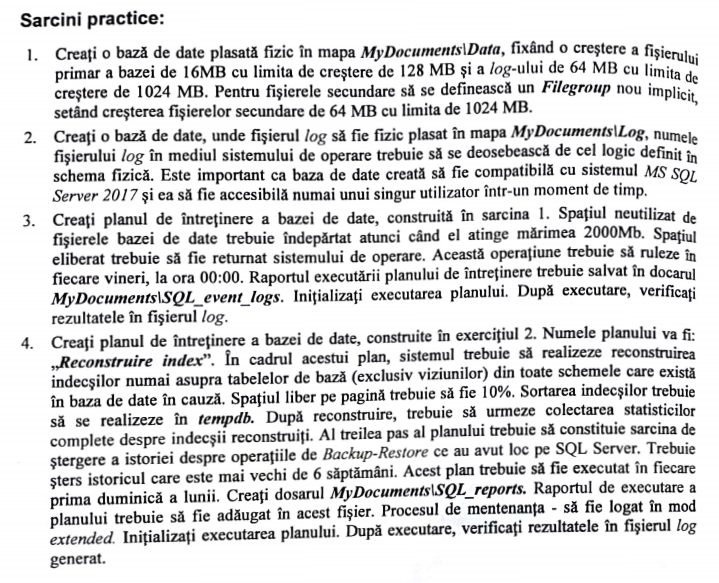
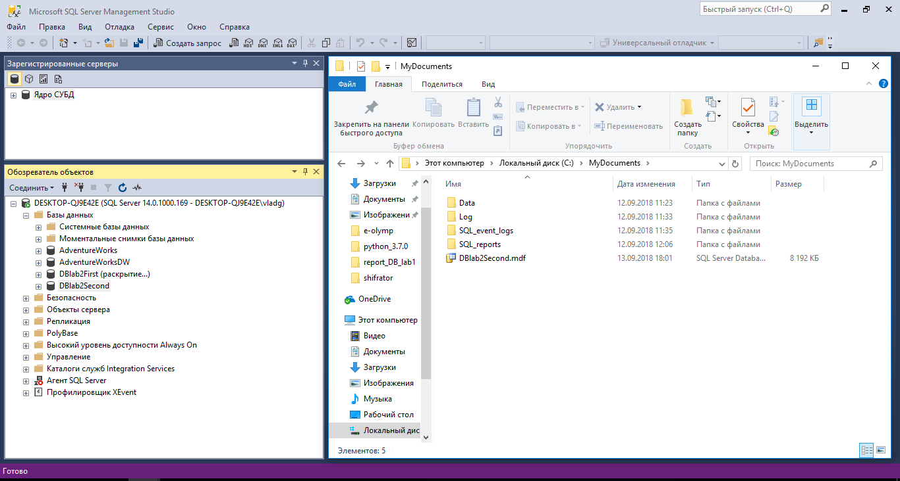
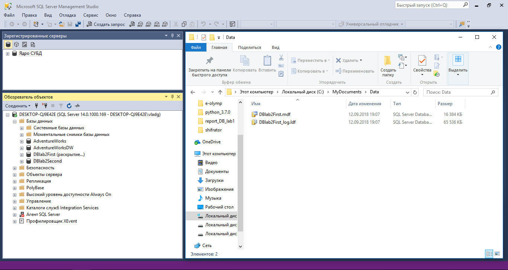

# _LABORATORY WORK #1_

## **Tasks**

## **Solutions**

In the final we should get the following files in the folder _**MyDocuments**_:

In this directory there is a folder _**Data**_ in which are files for first database functionality:

In the folder _**Log**_ there is a file with extension _.idf_ and in the relative root (_**MyDocuments**_) there is another file linked with corresponding Database (it has extension _.mdf_)

This is how should be maintained the second DB we _Reconstruire index_ maintance. I used nasted plans in order to have positive result.

## **Conclusions**

In this laboratory work I have developed my skill in database creation and managing. 

There were a lot of important moments which are linked with notifications. For example, the best way to create a notification is to use _Notification Manage_ and to do all on-go. There is another one solution: _Create new notification_ (but in this case the DB administrator will be allowed to do all manipulations apart in order to gain the same result as using _Notification Manager_).

In a nutshell, the right use of tools allows us to create safety _Maintance plans_ for each DB: keeping copy of database, automanagement of it, cleaning old copies, recoveries etc.

# Pre Questions

## Types of Files in Microsoft SQL Server 2017:

1. _Primary_
   	
   The primary data file contains the startup information for the database and points to the other files in the database. User data and objects can be stored in this file or in secondary data files. Every database has one primary data file. The recommended file name extension for primary data files is _**.mdf**_.

2. _Secondary_
   
   Secondary data files are optional, are user-defined, and store user data. Secondary files can be used to spread data across multiple disks by putting each file on a different disk drive. Additionally, if a database exceeds the maximum size for a single Windows file, you can use secondary data files so the database can continue to grow.
   
   The recommended file name extension for secondary data files is _**.ndf**_.

3. _Transaction Log_	
    
    The transaction log files hold the log information that is used to recover the database. There must be at least one log file for each database. The recommended file name extension for transaction logs is _**.ldf**_.

## Page structure:

1. _Page header_
   
   It's size is 96-byte. It stores system information about the page such as the _page number_, _page type_ and the _amount of free space_ on the page. Also it has the _allocation unit ID_ of the object that owns the page.

2. _Data Rows_
   
   The appearence of the Data rows starts immediatly _after the Page header_. Also the sequence of Data rows are _serial_.

3. _Row offsets_
   
   It starts at the end of the page. Each row offset table contains one entry for each row on the page. Also each entry records how far the first byte of the row is from the start of the page. The entries in the row offset table are in reverse sequence from the sequence of the rows on the page.

## System databases

1. _master_
   
   	records all the _**system-level**_ information for an instance of SQL Server.

2. _msdb_
   
    is used by SQL Server Agent for _**scheduling alerts and jobs**_.

3. _model_
   
    is used as the _**template**_ for all databases created on the instance of SQL Server. 
    Any modifications made to the model database (database size, collation, recovery model etc.) are applied to any databases created _**afterward**_.

4. _Resource_
   
    is a _**read-only database**_ that contains system objects that are included with SQL Server. 
    * System objects are physically persisted in the Resource database;
    * System objects logically appear in the sys schema of every database.

5. _tempdb_
   
    is a workspace used for
    * holding temporary objects;
    * holding intermediate result sets.

## How to create DB in SQL Server Management Studio

1. Connect to an instance of the SQL Server Database Engine;

2. Expand choosing instance;

3. Choose create New Database: click New Database by right-click on Databases field;

4. Enter the database name;

5. Put the values for Database or let them be default;

6. Click OK to accept changes.

## Maintenance Plan

Maintenance plans create a workflow of the tasks required to make sure that your database 

* is optimized; 
* regularly backed up; 
* and free of inconsistencies.

Maintenance plans can be created:

* using Maintenance Plan wizard;
* manually.
