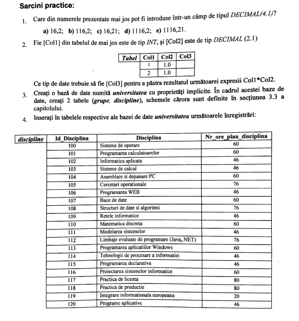
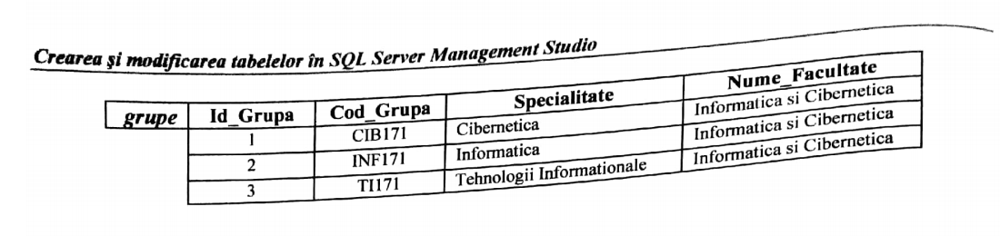
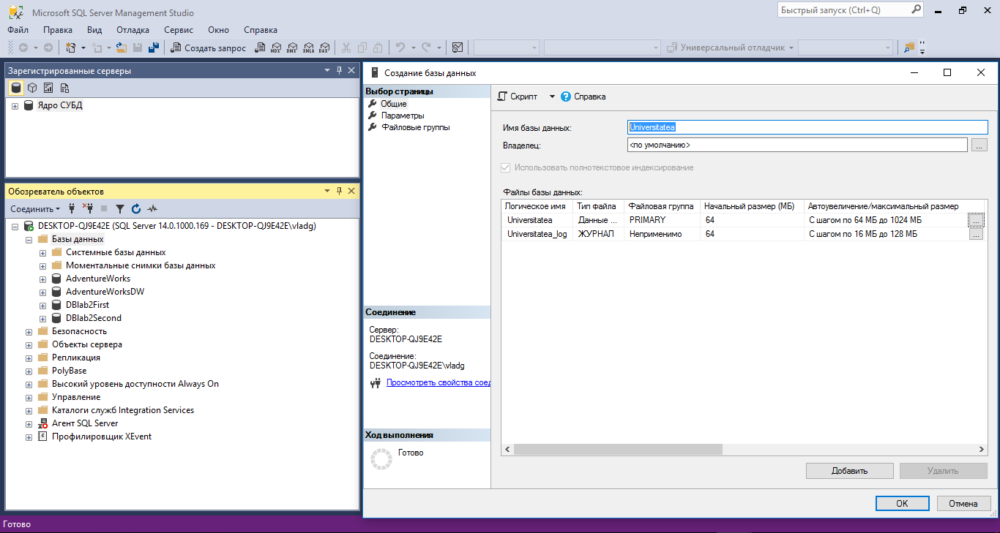
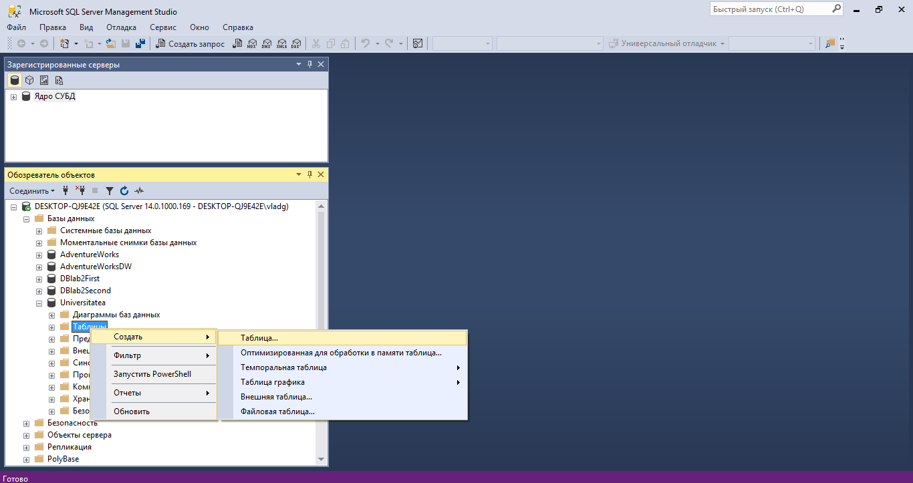
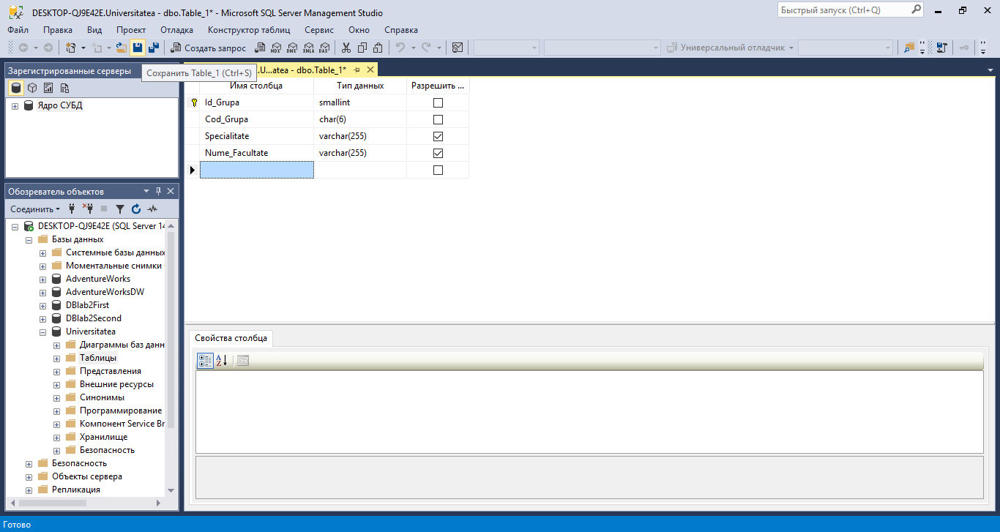
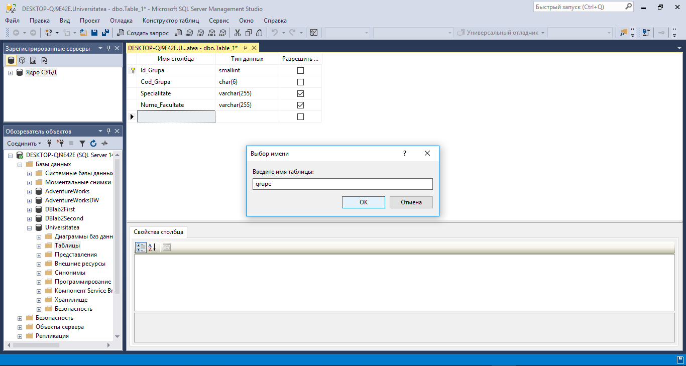
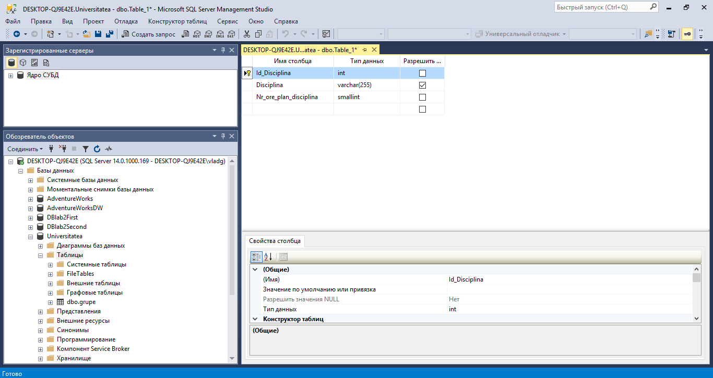
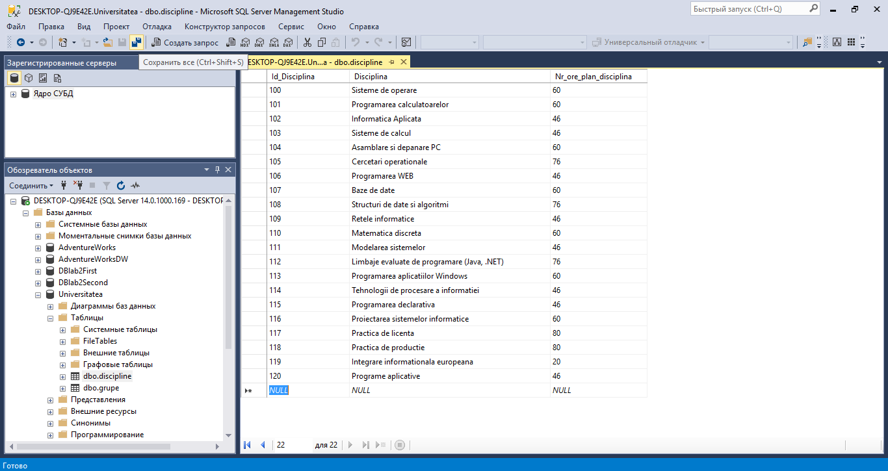
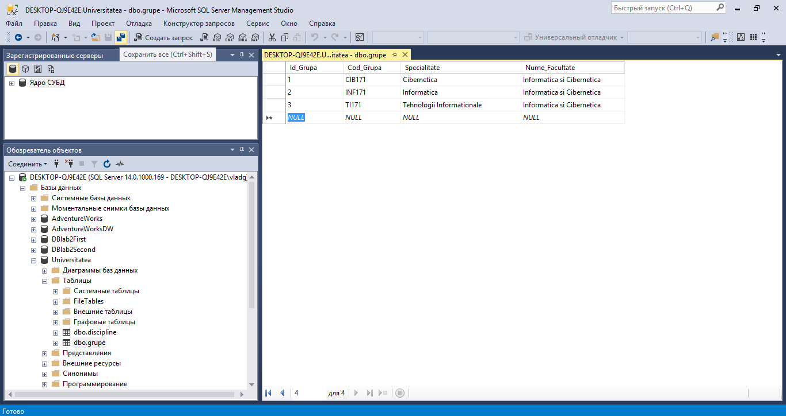

# Tasks

# Solutions

1. For such field with typw DECIMAL(4, 1) can correspond the following values: 
  _**16,2**_ and _**116,2**_, because the decimal number in this context can have maximum 4 digits and the maximum number of digits after point is equal to one.
2. For this example the third column should have type _**DECIMAL**_. In this case minimum restrictions for _**P**_ and _**S**_ are _**2**_ and _**1**_ respectively.

    The optimal way is _DECIMAL(2, 1)_.

## Main Part

First of all, I must create the Database _**Universitatea**_ in which will be kept some tables. It is optional, but I have limited the maximum size of this DB, also I have regestered maximum step (in MB) that use(s) can fill the DB.

The next step is creating the first table in _**Universitatea**_ DB. In this DB with Right-click choose the following -> create -> table.

Now it is important to define all attributes: name, type, size and Nullability. After defining all the attributes, we should choose the primary key. *Primary key never can have NULL value.
In order to save the table we should click to corresponding icon on the toolbar.

After clicking on the SAVE button (icon from toolbar) will be opened a window where we should enter the naim of the table.
The name of our table is _**grupe**_.

The procedure of defining the table _**discipline**_ and setting its primary key is the same as in the examples above.

The last two steps is filling the two corresponding tables.

Filling the table _**grupe**_:

Filling the table _**discipline**_:

## Conclusions

In this laboratory work we have stadied how to create, modify and delete tables into the database. In order to create a table all its attributes should be analized: type of the field, its size, constraints, Nullability etc.

Also we have stadied description of the basic datatypes in the Microsoft SQL Server and different tricks of their usage. For example, such types as Decimal or Numeric have their own parameters which indicate the max number of digits in the corresponding number (precision) and the maximum floating digits (digits after comma (',')).

If there is a necessity to create new attributes in the existent table, the new fields should have such propreties as Nullability ans/or default values.

Also not all the attributes can be modified, it depends on different cases and moments. For example, It is impossible to change DATETIME into CHAR(45).

# Pre Questions

## What kind of proprities must have column

The maximum number of columns can reach 1024 items. Also every column must have its own name and datatype. It is impossible to have two or more columns with the same name in a table.

## What kind of datatypes can be used in Microsoft SQL Server

In Microsoft SQL Server datatypes can be grouped in the following way:

1. Fixed numeric numbers
   * BIGINT
   * INT
   * SMALLINT
   * TINYINT
   * BIT
   * DECIMAL
   * MONEY
   * SMALLMONEY
2. Aproximative (float) numbers
    * FLOAT(N)
    * REAL  
3. Sequence of characters
   * CHAR(N)
   * VARCHAR[(N | MAX)]
   * TEXT
4. Binary types
   * BINARY(N)
   * VARBINARY[(N | MAX)]
   * IMAGE
5. Date/Time datatypes
   * DATETIME
   * DATETIME2
   * DATE
   * TIME
   * DATETIMEOFFSET
   * SMALLDATETIME
6. Special datatypes
   * CURSOR
   * HIERARCHYID
   * SQL_VARIANT
   * TABLE
   * TIMESTAMP
   * UNIQUEIDENTIFIER
   * XML
7. UNICODE datatypes
   * NCHAR(N)
   * NVARCHAR[(N | MAX)]
   * NTEXT

## What kind of integrity constraints does Microsoft SQL Server use in order to keep consistence of the Database

In order to keep DB consistence Microsoft SQL Server uses such features as PRIMARY KEY, DEFAULT value etc. Otherwise the DB is inconsistent!

There are FIVE constraints of integrity:
1. NOT NULL
2. UNIQUE
3. PRIMARY KEY
4. FOREIGN KEY
5. CHECK

## What kind of difficulties can have the user deleteing attributes of existent tables.

Deleteing attributes from the table user should keep in mind that one or more choosen attributes may be PRIMARY or FOREIGN keys. The solution is to destroy these constraints, delete choosen attributes, and then to set new Primary/Foreign keys.

## What kind of difficulties can have the user modifying attributes of existent tables. Attributes that can't be modificated in the existent table

There are several ways how to modify the structure of the table:
1. To modify structure of the table:
   
   If the user has decided to add some additional attributes in the table, those attribuse should be Nullable or to have Default values. It is because the Microsoft SQL Server automatically will fill corresponding attributes in all tupples with Null/Default values.
2. To modify proprieties of column(s):
   
   Not always it is possible. The reason is that these columns are computed or actually are participating in some computational processes. They also can have such types as TIMESTAMP or UNIQUEIDENTIFIER. On the column(s) also may be PRIMARY KEY constrait and etc.
