# Tasks

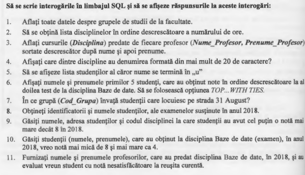

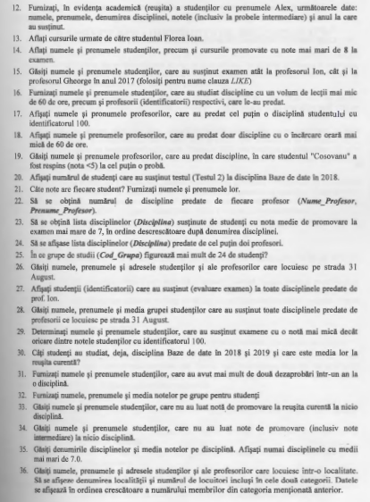

# Solutions

**1.** [Code:](Scripts/Lab4_Task1.sql)
```javascript
    SELECT *
    FROM grupe as g
    ORDER BY g.Nume_Facultate ASC
```
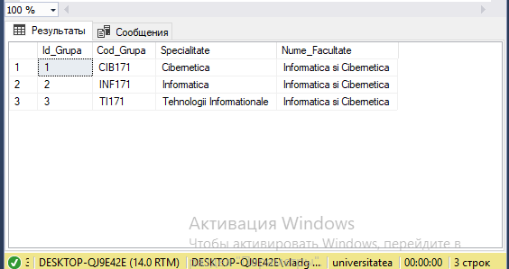

**2.** [Code:](Scripts/Lab4_Task2.sql) 
```javascript
    SELECT *
    FROM discipline
    ORDER BY Nr_ore_plan_disciplina DESC
```
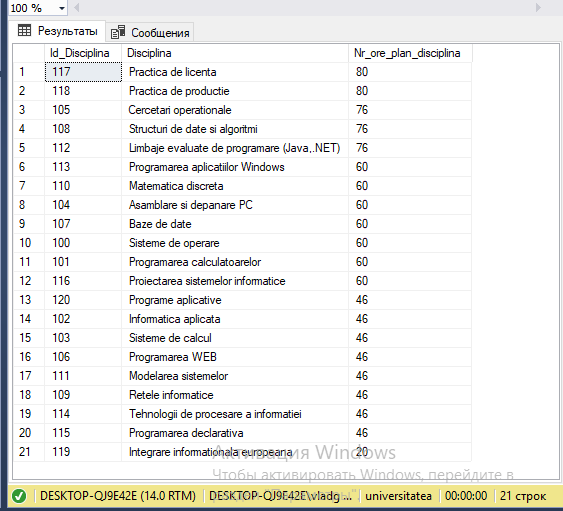

**3.** [Code (I variant):](Scripts/Lab4_Task3_var1.sql)
```javascript
    SELECT DISTINCT Disciplina, Nume_Profesor, Prenume_Profesor
    FROM discipline as dis, profesori as prof, studenti_reusita as st
    WHERE dis.Id_Disciplina = st.Id_Disciplina
          and prof.Id_Profesor = st.Id_Profesor
    ORDER BY prof.Nume_Profesor DESC, prof.Prenume_Profesor DESC
```

[Code (II variant):](Scripts/Lab4_Task3_var2.sql)

```javascript
    SELECT DISTINCT Disciplina, Nume_Profesor, Prenume_Profesor
    FROM (discipline as d INNER JOIN studenti_reusita as st_r
    	ON d.Id_Disciplina = st_r.Id_Disciplina)
    	INNER JOIN profesori as p
    	ON p.Id_Profesor = st_r.Id_Profesor
    ORDER BY Nume_Profesor DESC, Prenume_Profesor DESC
```
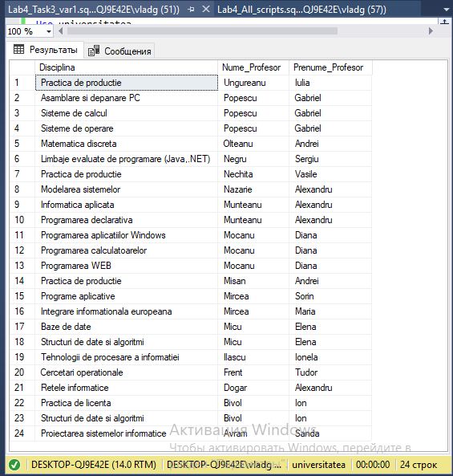

**4.** [Code:](Scripts/Lab4_Task4.sql)
```javascript
    SELECT Disciplina
    FROM discipline
    WHERE LEN(Disciplina) > 20
```
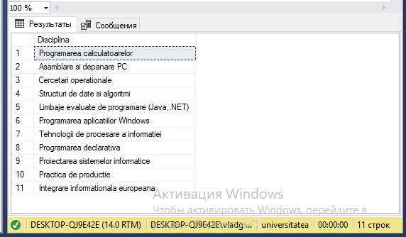

[Check results:](Scripts/Lab4_Task4_Check.sql)

```javascript
    SELECT d.Disciplina, LEN(d.Disciplina) as NameLength
    FROM discipline as d
    WHERE LEN(d.Disciplina) > 20
```
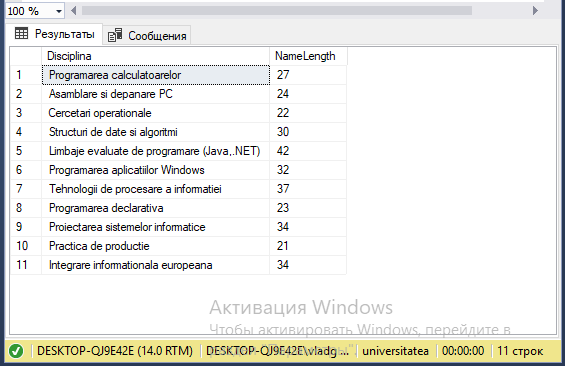

**5.** [Code:](Scripts/Lab4_Task5.sql)
```javascript
    SELECT *
    FROM studenti
    WHERE Nume_Student LIKE '%u'
```
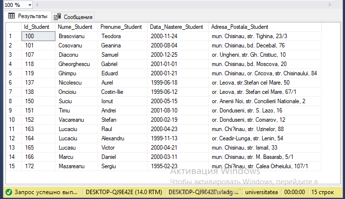

**6.** [Code (I variant):](Scripts/Lab4_Task6_var1.sql)
```javascript
    SELECT TOP 5 Nume_Student, Prenume_Student
    FROM (studenti as st INNER JOIN studenti_reusita as st_r
    	ON st.Id_Student = st_r.Id_Student)
    	INNER JOIN discipline as d
    	ON st_r.Id_Disciplina = d.Id_Disciplina
    WHERE Tip_Evaluare LIKE '%2' and Disciplina = 'Baze de date'
    ORDER BY Nota DESC
```
    
[Code (II variant):](Scripts/Lab4_Task6_var2.sql)

```javascript
    SELECT TOP 5 Nume_Student, Prenume_Student
    FROM studenti as st INNER JOIN studenti_reusita as st_r
    	ON st.Id_Student = st_r.Id_Student
    WHERE Tip_Evaluare LIKE '%2' and st_r.Id_Disciplina = 
    	(SELECT d.Id_Disciplina
    	FROM discipline as d 
    	WHERE d.Disciplina = 'Baze de date')
    ORDER BY Nota DESC
```
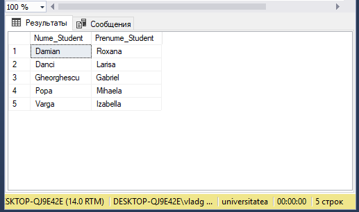

**7.** [Code (I variant):](Scripts/Lab4_Task7_var1.sql)
```javascript
    SELECT Cod_Grupa
    FROM grupe
    WHERE Id_Grupa IN 
    	(SELECT st_r.Id_Grupa
    	FROM studenti_reusita as st_r
    	WHERE st_r.Id_Student IN 
    		(SELECT st.Id_Student
    		FROM studenti as st
    		WHERE st.Adresa_Postala_Student LIKE '%31 August%')
    	)
```

[Code (II variant):](Scripts/Lab4_Task7_var2.sql)

```javascript
    SELECT DISTINCT Cod_Grupa
    FROM (grupe as g INNER JOIN studenti_reusita as st_r
    	ON g.Id_Grupa = st_r.Id_Grupa) INNER JOIN studenti as st
    		ON st_r.Id_Student = st.Id_Student
    	WHERE Adresa_Postala_Student LIKE '%31 August%'
```
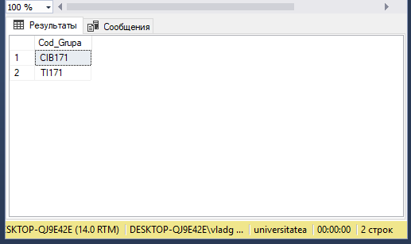

**8.** [Code (I variant):](Scripts/Lab4_Task8_var1.sql)
```javascript
    SELECT Id_Student, Nume_Student, Prenume_Student
    FROM studenti
    WHERE Id_Student IN
    	(SELECT st_r.Id_Student
    	FROM studenti_reusita as st_r
    	WHERE st_r.Data_Evaluare LIKE '%2018%' and st_r.Tip_Evaluare = 'Examen')
```

[Code (II variant):](Scripts/Lab4_Task8_var2.sql)

```javascript
    SELECT DISTINCT st.Id_Student, Nume_Student, Prenume_Student
    FROM studenti as st INNER JOIN studenti_reusita as st_r
    ON st.Id_Student = st_r.Id_Student
    WHERE Data_Evaluare LIKE '%2018%' and Tip_Evaluare = 'Examen'
```

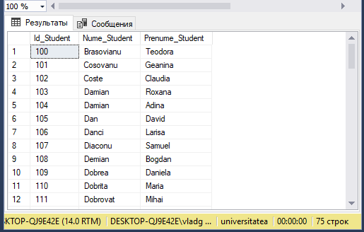

**9.** [Code (I variant):](Scripts/Lab4_Task9_var1.sql)
    
```javascript
    SELECT DISTINCT st.Nume_Student, st.Prenume_Student, st.Adresa_Postala_Student, st_r.Id_Disciplina  
    FROM studenti as st, studenti_reusita as st_r
    WHERE st.Id_Student = st_r.Id_Student and st_r.Nota > 8 and st_r.Data_Evaluare LIKE '2018%'
    ORDER BY st.Nume_Student ASC, st.Prenume_Student ASC
```

[Code (II variant)](Scripts/Lab4_Task9_var2.sql)

```javascript
    SELECT DISTINCT Nume_Student, Prenume_Student, Adresa_Postala_Student, Id_Disciplina
    FROM studenti as st INNER JOIN studenti_reusita as st_r
    ON st.Id_Student = st_r.Id_Student
    WHERE Nota > 8 and Data_Evaluare LIKE '2018%'
    ORDER BY Nume_Student ASC, Prenume_Student ASC
```
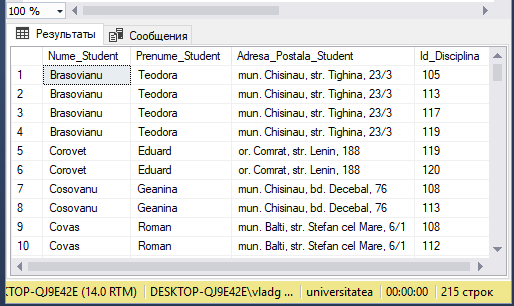

**10.** [Code (I variant):](Scripts/Lab4_Task10_var1.sql)

```javascript
    SELECT st.Nume_Student, st.Prenume_Student
    FROM studenti as st
    WHERE st.Id_Student IN
    	(SELECT st_r.Id_Student
    	FROM studenti_reusita as st_r
    	WHERE st_r.Nota < 8 and st_r.Nota > 4 and st_r.Tip_Evaluare = 'Examen' and
    		st_r.Id_Disciplina IN
    		(SELECT d.Id_Disciplina
    		FROM discipline as d
    		WHERE d.Disciplina = 'Baze de date'))
```

[Code (II variant):](Scripts/Lab4_Task10_var2.sql)

```javascript
    SELECT Nume_Student, Prenume_Student
    FROM (studenti as st INNER JOIN studenti_reusita as st_r
    	ON st.Id_Student = st_r.Id_Student)
    	INNER JOIN discipline as d
    	ON st_r.Id_Disciplina = d.Id_Disciplina
    	WHERE Disciplina = 'Baze de date' and Nota < 8 and Nota > 4 and Tip_Evaluare = 'Examen'
```
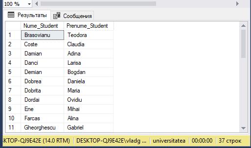

**11.** [Code (I variant):](Scripts/Lab4_Task11_var1.sql)

```javascript
    SELECT p.Nume_Profesor, p.Prenume_Profesor
    FROM profesori as p
    WHERE p.Id_Profesor IN
    	(SELECT st_r.Id_Profesor
    	FROM studenti_reusita as st_r
    	WHERE st_r.Tip_Evaluare LIKE 'Reusita%' and st_r.Id_Disciplina IN 
    		(SELECT d.Id_Disciplina
    		FROM discipline as d
    		WHERE d.Disciplina LIKE '%Baze de date%')
    and st_r.Nota < 5 and st_r.Data_Evaluare LIKE '2018%')
```

[Code (II variant):](Scripts/Lab4_Task11_var2.sql)

```javascript
    SELECT DISTINCT Nume_Profesor, Prenume_Profesor
    FROM (profesori as p INNER JOIN studenti_reusita as st_r
    	ON p.Id_Profesor = st_r.Id_Profesor) INNER JOIN discipline as d
    		ON st_r.Id_Disciplina = d.Id_Disciplina
    WHERE Disciplina = 'Baze de date' and Data_Evaluare LIKE '%2018%' and Nota < 5 and Tip_Evaluare LIKE 'Reusita%'
```
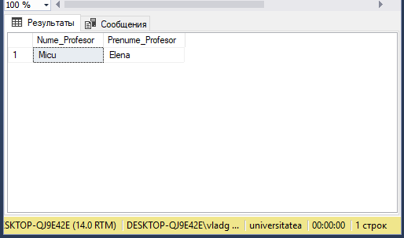


**12.** [Code (I variant):](Scripts/Lab4_Task12_var1.sql)
    
```javascript
    SELECT Nume_Student, Prenume_Student, Disciplina,
    (SELECT DISTINCT ANS1.Nota FROM studenti_reusita as ANS1 WHERE ANS1.Id_Student = st.Id_Student and ANS1.Tip_Evaluare = 'Testul 1' and ANS1.Id_Disciplina = st_r.Id_Disciplina) as Test1,
    (SELECT DISTINCT substring(CONVERT(VARCHAR(8), ANS1_data.Data_Evaluare), 0, 5)  FROM studenti_reusita as ANS1_data WHERE ANS1_data.Id_Student = st.Id_Student and ANS1_data.Tip_Evaluare = 'Testul 1' and ANS1_data.Id_Disciplina = st_r.Id_Disciplina) as 'Testul 1 Year',
    (SELECT DISTINCT ANS2.Nota FROM studenti_reusita as ANS2 WHERE ANS2.Id_Student = st.Id_Student and ANS2.Tip_Evaluare = 'Testul 2' and ANS2.Id_Disciplina = st_r.Id_Disciplina) as Test2,
    (SELECT DISTINCT substring(CONVERT(VARCHAR(8), ANS2_data.Data_Evaluare), 0, 5)  FROM studenti_reusita as ANS2_data WHERE ANS2_data.Id_Student = st.Id_Student and ANS2_data.Tip_Evaluare = 'Testul 2' and ANS2_data.Id_Disciplina = st_r.Id_Disciplina) as 'Testul 2 Year',
    (SELECT DISTINCT ANS3.Nota FROM studenti_reusita as ANS3 WHERE ANS3.Id_Student = st.Id_Student and ANS3.Tip_Evaluare = 'Examen' and ANS3.Id_Disciplina = st_r.Id_Disciplina) as EXAMEN,
    (SELECT DISTINCT substring(CONVERT(VARCHAR(8), ANS3_data.Data_Evaluare), 0, 5)  FROM studenti_reusita as ANS3_data WHERE ANS3_data.Id_Student = st.Id_Student and ANS3_data.Tip_Evaluare = 'Examen' and ANS3_data.Id_Disciplina = st_r.Id_Disciplina) as 'Examen Year',
    (SELECT DISTINCT ANS4.Nota FROM studenti_reusita as ANS4 WHERE ANS4.Id_Student = st.Id_Student and ANS4.Tip_Evaluare LIKE 'Reusita%' and ANS4.Id_Disciplina = st_r.Id_Disciplina) as Final_Note,
    (SELECT DISTINCT substring(CONVERT(VARCHAR(8), ANS4_data.Data_Evaluare), 0, 5)  FROM studenti_reusita as ANS4_data WHERE ANS4_data.Id_Student = st.Id_Student and ANS4_data.Tip_Evaluare LIKE '%Reusita%' and ANS4_data.Id_Disciplina = st_r.Id_Disciplina) as 'Final note Year'
    FROM (studenti as st INNER JOIN studenti_reusita as st_r
    	ON st.Id_Student = st_r.Id_Student) INNER JOIN discipline as d
    		ON st_r.Id_Disciplina = d.Id_Disciplina
    WHERE Prenume_Student = 'Alex' and Tip_Evaluare LIKE 'Reusita%'
```
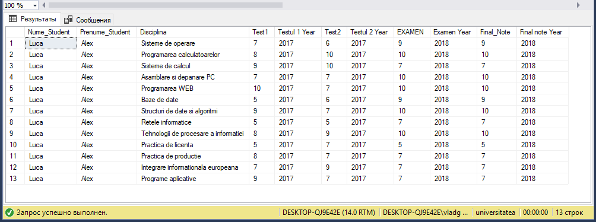

[Code (II variant):](Scripts/Lab4_Task12_var2.sql)

```javascript
    SELECT DISTINCT Nume_Student, Prenume_Student, Disciplina, Tip_Evaluare, Nota, substring(CONVERT(VARCHAR(8), Data_Evaluare), 0, 5) as Anul
    FROM (studenti as st INNER JOIN studenti_reusita as st_r
	    ON st.Id_Student = st_r.Id_Student) INNER JOIN discipline as d
		ON st_r.Id_Disciplina = d.Id_Disciplina
    WHERE Prenume_Student = 'Alex'
```
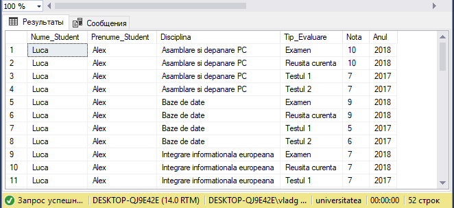

**13.** [Code (I variant):](Scripts/Lab4_Task13_var1.sql)

```javascript
    SELECT d.Disciplina
    ROM discipline as d
    WHERE d.Id_Disciplina IN
	    (SELECT st_r.Id_Disciplina
	    FROM studenti_reusita as st_r
	    WHERE st_r.Id_Student =
		    (SELECT st.Id_Student
		    FROM studenti as st
		    WHERE st.Nume_Student = 'Florea' and st.Prenume_Student = 'Ioan')
```
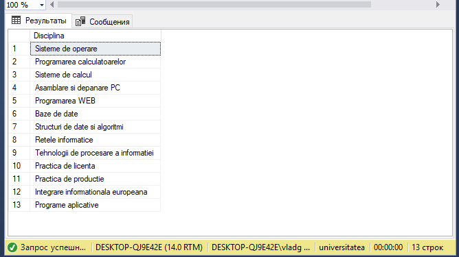

[Code (II variant):](Scripts/Lab4_Task13_var2.sql)
        
```javascript
    SELECT curr_st.Id_Student, d.Disciplina
    FROM studenti as curr_st, discipline as d
    WHERE curr_st.Nume_Student = 'Florea' and curr_st.Prenume_Student = 'Ioan'
    and curr_st.Id_Student IN 
		(SELECT st_r.Id_Student
		FROM studenti_reusita as st_r
		WHERE d.Id_Disciplina = st_r.Id_Disciplina)
```
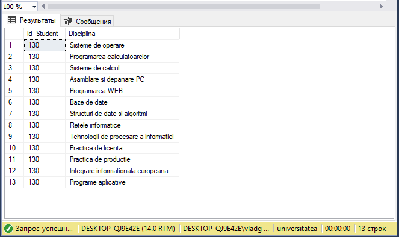

**14.** [Code (I variant):](Scripts/Lab4_Task14_var1.sql)
```javascript
    SELECT st.Nume_Student, st.Prenume_Student, d.Disciplina
    FROM studenti as st, discipline as d
    WHERE st.Id_Student IN 
        (SELECT st_r.Id_Student
        FROM studenti_reusita as st_r
        WHERE st_r.Nota > 8 and st_r.Tip_Evaluare = 'Examen'
    	and d.Id_Disciplina = st_r.Id_Disciplina)
```

[Code (II variant):](Scripts/Lab4_Task14_var2.sql)
    
```javascript
    SELECT Nume_Student, Prenume_Student, Disciplina
    FROM (studenti as st INNER JOIN studenti_reusita as st_r
    	ON st.Id_Student = st_r.Id_Student) INNER JOIN discipline as d
    	ON d.Id_Disciplina = st_r.Id_Disciplina
    WHERE Nota > 8 and Tip_Evaluare = 'Examen'
```
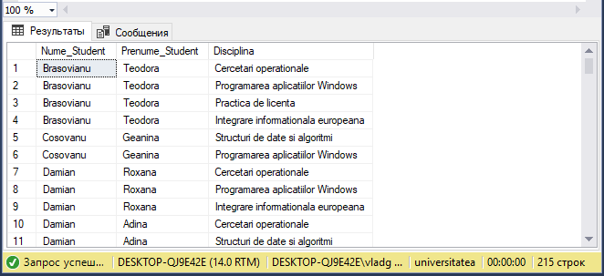

**15.** [Code (I variant):](Scripts/Lab4_Task15_var1.sql)
```javascript
SELECT st.Nume_Student, st.Prenume_Student
FROM (studenti as st INNER JOIN studenti_reusita as st_r
	ON st.Id_Student = st_r.Id_Student) INNER JOIN profesori as pr
	ON pr.Id_Profesor = st_r.Id_Profesor
WHERE st_r.Tip_Evaluare = 'Examen' and DATEPART(YEAR, st_r.Data_Evaluare) = 2018 and pr.Prenume_Profesor LIKE 'Ion'

INTERSECT

SELECT st.Nume_Student, st.Prenume_Student
FROM (studenti as st INNER JOIN studenti_reusita as st_r
	ON st.Id_Student = st_r.Id_Student) INNER JOIN profesori as pr
	ON pr.Id_Profesor = st_r.Id_Profesor
WHERE st_r.Tip_Evaluare = 'Examen' and DATEPART(YEAR, st_r.Data_Evaluare) = 2018 and pr.Prenume_Profesor LIKE 'Gabriel'

```

[Code (II variant):](Scripts/Lab4_Task15_var2.sql)

```javascript
SELECT DISTINCT Nume_Student, Prenume_Student
FROM (SELECT st.Id_Student, st.Nume_Student, st.Prenume_Student
	FROM (studenti as st INNER JOIN studenti_reusita as st_r
		ON st.Id_Student = st_r.Id_Student) INNER JOIN profesori as pr
		ON pr.Id_Profesor = st_r.Id_Profesor
	WHERE pr.Prenume_Profesor LIKE 'Ion'

	INTERSECT

	SELECT st.Id_Student, st.Nume_Student, st.Prenume_Student
	FROM (studenti as st INNER JOIN studenti_reusita as st_r
		ON st.Id_Student = st_r.Id_Student) INNER JOIN profesori as pr
		ON pr.Id_Profesor = st_r.Id_Profesor
	WHERE pr.Prenume_Profesor LIKE 'Gabriel') AS tmp INNER JOIN studenti_reusita as reus
	ON tmp.Id_Student = reus.Id_Student
WHERE Tip_Evaluare = 'Examen' and DATEPART(YEAR, Data_Evaluare) = 2018
```
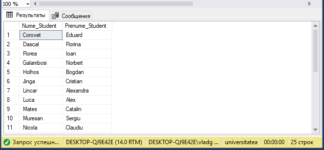

**16.** [Code (I variant):](Scripts/Lab4_Task16_var1.sql)
```javascript
    SELECT d.Disciplina, st.Nume_Student, st.Prenume_Student, pr.Id_Profesor, pr.Nume_Profesor, pr.Prenume_Profesor 
    FROM discipline as d
    	CROSS JOIN 
    	studenti as st
    	CROSS JOIN 
    	profesori as pr
    WHERE d.Nr_ore_plan_disciplina < 60 and
    	EXISTS
    	(SELECT st_r.Id_Student
    	 FROM studenti_reusita as st_r
    	 WHERE st_r.Id_Disciplina = d.Id_Disciplina and 
    		st_r.Id_Student = st.Id_Student and
    			st_r.Id_Profesor = pr.Id_Profesor)
    ORDER BY pr.Id_Profesor ASC
```

[Code (II variant):](Scripts/Lab4_Task16_var2.sql)

```javascript
    SELECT DISTINCT Disciplina, Nume_Student, Prenume_Student, pr.Id_Profesor, Nume_Profesor, Prenume_Profesor
    FROM ((studenti as st INNER JOIN studenti_reusita as st_r
    	ON st.Id_Student = st_r.Id_Student) INNER JOIN discipline as d
    	ON st_r.Id_Disciplina = d.Id_Disciplina) INNER JOIN profesori as pr
    	ON st_r.Id_Profesor = pr.Id_Profesor
    WHERE Nr_ore_plan_disciplina < 60
    ORDER BY pr.Id_Profesor ASC
```
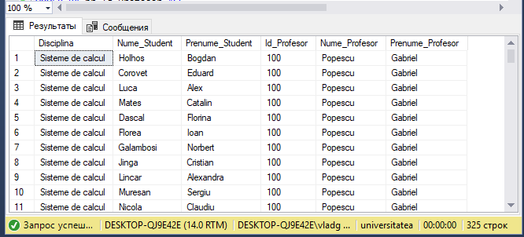


**17.** [Code (I variant):](Scripts/Lab4_Task17_var1.sql)
    
```javascript
    SELECT DISTINCT pr.Nume_Profesor, pr.Prenume_Profesor
    FROM profesori as pr
    	CROSS JOIN
    	studenti as st
    WHERE EXISTS
    	(SELECT st_r.Id_Disciplina
    	FROM studenti_reusita as st_r
    	WHERE st.Id_Student = 100
    		and pr.Id_Profesor = st_r.Id_Profesor
    		and st.Id_Student = st_r.Id_Student
    	)
```

[Code (II variant):](Scripts/Lab4_Task17_var2.sql)
    
```javascript
    SELECT DISTINCT Nume_Profesor, Prenume_Profesor
    FROM (profesori as pr INNER JOIN studenti_reusita as st_r
    	ON pr.Id_Profesor = st_r.Id_Profesor) INNER JOIN studenti as st
    	ON st_r.Id_Student = st.Id_Student
    WHERE st.Id_Student = 100
```
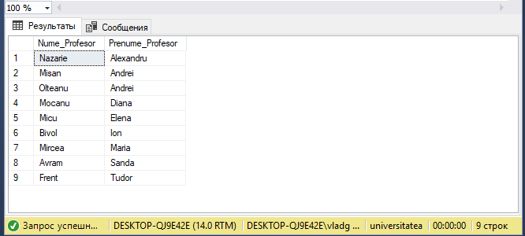

**18.** [Code:](Scripts/Lab4_Task18.sql)
    
```javascript
    SELECT DISTINCT Nume_Profesor, Prenume_Profesor
    FROM profesori as p INNER JOIN studenti_reusita as st_r
    	ON p.Id_Profesor = st_r.Id_Profesor
    WHERE NOT EXISTS
    	(SELECT st_r1.Id_Profesor
    	FROM studenti_reusita as st_r1 INNER JOIN discipline as d
    		ON st_r1.Id_Disciplina = d.Id_Disciplina
    	WHERE st_r.Id_Disciplina = st_r1.Id_Disciplina and d.Nr_ore_plan_disciplina >= 60)
```
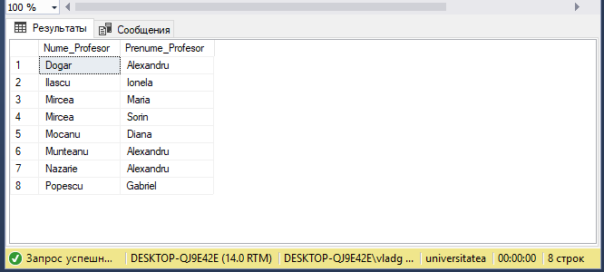

**19.** [Code (I variant):](Scripts/Lab4_Task19_var1.sql)
    
```javascript
    SELECT DISTINCT Nume_Profesor, Prenume_Profesor
    FROM profesori as pr INNER JOIN studenti_reusita as st_r
    	ON pr.Id_Profesor = st_r.Id_Profesor
    WHERE st_r.Nota < 5 and st_r.Id_Student IN
    	(SELECT st.Id_Student
    	FROM studenti as st
    	WHERE st.Nume_Student LIKE 'Cosovanu')
```

[Code (II variant):](Scripts/Lab4_Task19_var2.sql)
    
```javascript
    SELECT DISTINCT Nume_Profesor, Prenume_Profesor
    FROM (profesori as pr INNER JOIN studenti_reusita as st_r
    	ON pr.Id_Profesor = st_r.Id_Profesor) INNER JOIN studenti as st
    	ON st.Id_Student = st_r.Id_Student
    WHERE st.Nume_Student LIKE 'Cosovanu' and st_r.Nota < 5
```
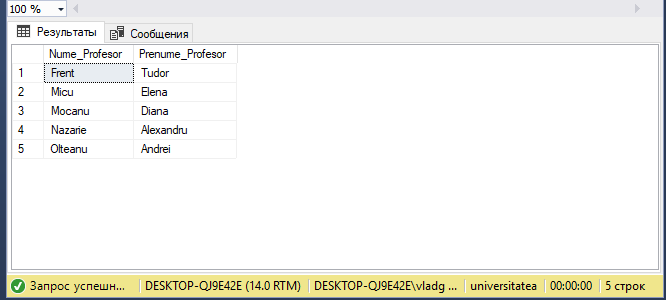

**20.** [Code (I variant):](Scripts/Lab4_Task20_var1.sql)
    
```javascript
    SELECT COUNT(st_r.Id_Student) as Successfull
    FROM studenti_reusita as st_r
    WHERE st_r.Nota > 4 and st_r.Nota IS NOT NULL and st_r.Tip_Evaluare = 'Testul 2' and st_r.Data_Evaluare LIKE '%2017%' and st_r.Id_Disciplina IN
    	(SELECT d.Id_Disciplina
    	FROM discipline as d
    	WHERE d.Disciplina = 'Baze de date')
```
    
[Code (II variant):](Scripts/Lab4_Task20_var2.sql)
    
```javascript
    SELECT COUNT(Nota) as Successfull
    FROM discipline as d INNER JOIN studenti_reusita as st_r
    	ON d.Id_Disciplina = st_r.Id_Disciplina
    WHERE d.Disciplina = 'Baze de date' and st_r.Tip_Evaluare = 'Testul 2' and st_r.Nota > 4
```
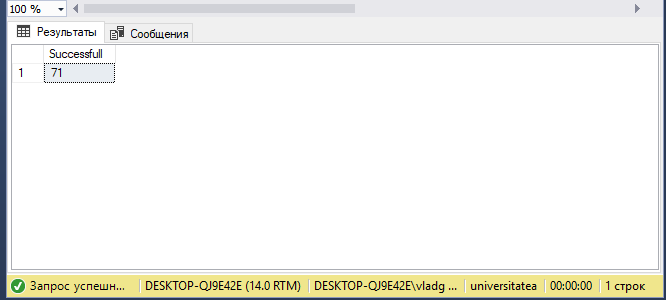

**21.** [Code:](Scripts/Lab4_Task21.sql)
```javascript
    SELECT Nume_Student, Prenume_Student, COUNT(Nota) as 'Numarul de note'
    FROM studenti as st INNER JOIN studenti_reusita as st_r
    	ON st.Id_Student = st_r.Id_Student
    GROUP BY Nume_Student, Prenume_Student
```
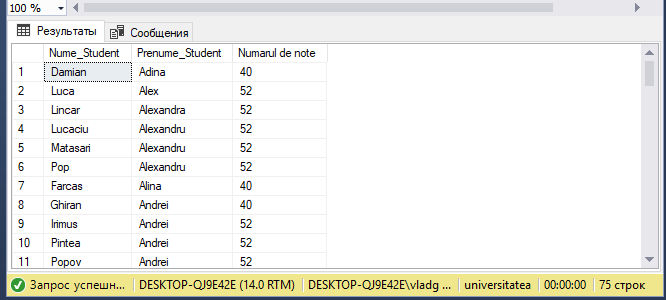

**22.** [Code:](Scripts/Lab4_Task22.sql)
    
```javascript
    SELECT Nume_Profesor, Prenume_Profesor, COUNT(DISTINCT Id_Disciplina) as 'Nr. de Discipline'
    FROM profesori as p INNER JOIN studenti_reusita as st_r
    	ON p.Id_Profesor = st_r.Id_Profesor
    GROUP BY Nume_Profesor, Prenume_Profesor
```
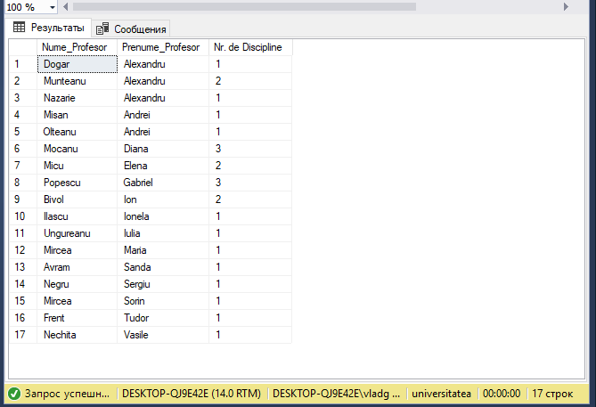

**23.** [Code:](Scripts/Lab4_Task23.sql)
```javascript
SELECT Disciplina  --, AVG(CAST(Nota as float)) as 'Nota medie pt. Examen'
FROM (studenti as st INNER JOIN studenti_reusita as st_r
	ON st.Id_Student = st_r.Id_Student) INNER JOIN discipline as d
	ON d.Id_Disciplina = st_r.Id_Disciplina
WHERE Tip_Evaluare = 'Examen'
GROUP BY Disciplina
HAVING AVG(CAST(Nota as float)) > 7
ORDER BY Disciplina DESC
```
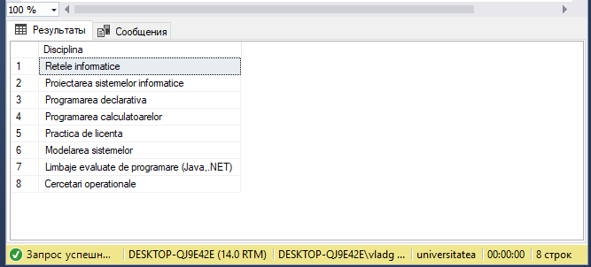

**24.** [Code:](Scripts/Lab4_Task24.sql)
```javascript
SELECT Disciplina, COUNT(DISTINCT pr.Id_Profesor)
FROM (discipline as d INNER JOIN studenti_reusita as st_r
	ON d.Id_Disciplina = st_r.Id_Disciplina) INNER JOIN profesori as pr
	ON pr.Id_Profesor = st_r.Id_Profesor
GROUP BY Disciplina
HAVING COUNT(DISTINCT pr.Id_Profesor) > 1
```
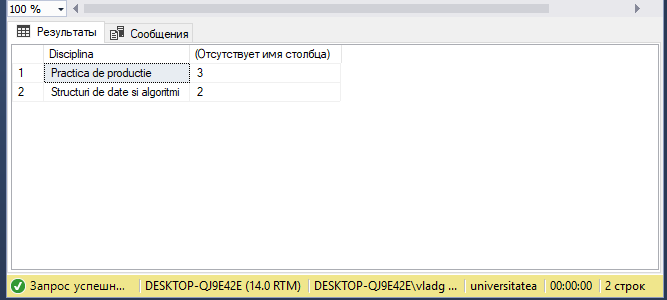

**25.** [Code:](Scripts/Lab4_Task25.sql)
```javascript
SELECT g.Cod_Grupa, COUNT(DISTINCT st_r.Id_Student) as 'Nr. Students'
FROM studenti_reusita as st_r INNER JOIN grupe as g
	ON g.Id_Grupa = st_r.Id_Grupa
GROUP BY g.Cod_Grupa
HAVING COUNT(DISTINCT st_r.Id_Student) > 24
```
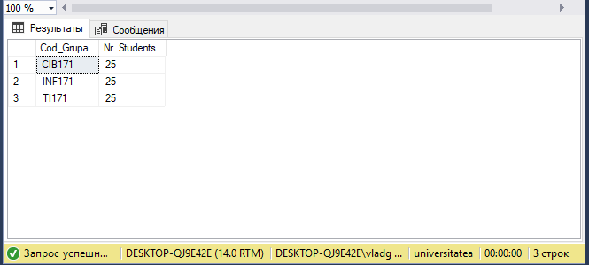

**26.** [Code:](Scripts/Lab4_Task26.sql)

```javascript
    SELECT st.Nume_Student as NUME, st.Prenume_Student as PRENUME, st.Adresa_Postala_Student as ADRESA, 'STUDENT' as WORK
    FROM studenti as st
    WHERE st.Adresa_Postala_Student LIKE '%31 August%'

    UNION

    SELECT pr.Nume_Profesor as NUME, pr.Prenume_Profesor as PRENUME, pr.Adresa_Postala_Profesor as ADRESA, 'PROFESOR' as WORK
    FROM profesori as pr
    WHERE pr.Adresa_Postala_Profesor LIKE '%31 August%'  -- LIKE '%44%'
```
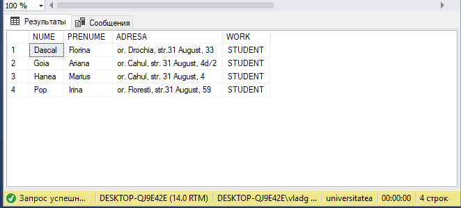

**27.** [Code:](Scripts/Lab4_Task27.sql)

```javascript
SELECT DISTINCT st.Id_Student, st.Nume_Student, st.Prenume_Student
FROM (studenti as st INNER JOIN studenti_reusita as stud_r
	ON st.Id_Student = stud_r.Id_Student) INNER JOIN profesori as prof
	ON stud_r.Id_Profesor = prof.Id_Profesor
WHERE prof.Prenume_Profesor = 'Ion'
GROUP BY st.Id_Student,  st.Nume_Student, st.Prenume_Student
HAVING COUNT(DISTINCT stud_r.Id_Disciplina) = 

	(SELECT COUNT(DISTINCT st_r.Id_Disciplina)
	FROM studenti_reusita as st_r INNER JOIN profesori as pr
		ON pr.Id_Profesor = st_r.Id_Profesor
	WHERE pr.Prenume_Profesor = 'Ion'
	GROUP BY pr.Id_Profesor)
```
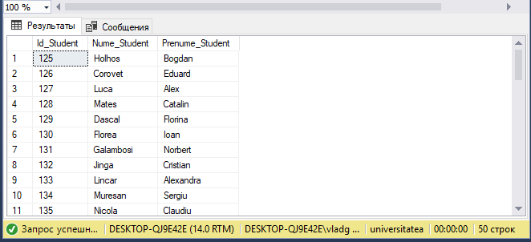

**28.** [Code:](Scripts/Lab4_Task28.sql)

```javascript
--28							Almost OK!
--SELECT st.Id_Student, Nume_Student, st.Prenume_Student
--FROM (studenti as st INNER JOIN studenti_reusita as st_r
--	ON st.Id_Student = st_r.Id_Student) INNER JOIN profesori as pr
--	ON st_r.Id_Profesor = pr.Id_Profesor
--WHERE pr.Adresa_Postala_Profesor LIKE '%44%'
--GROUP BY st.Id_Student, Nume_Student, st.Prenume_Student
--HAVING COUNT(DISTINCT pr.Id_Profesor) = 

--	(SELECT COUNT(DISTINCT p.Id_Profesor)
--	FROM profesori as p
--	WHERE p.Adresa_Postala_Profesor LIKE '%44%')
```
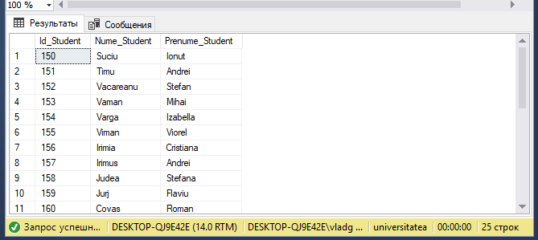

**29.** [Code (I variant):](Scripts/Lab4_Task29_var1.sql)

```javascript
SELECT DISTINCT st.Id_Student, st.Nume_Student, st.Prenume_Student
FROM studenti as st INNER JOIN studenti_reusita as st_r
	ON st.Id_Student = st_r.Id_Student
WHERE Tip_Evaluare = 'Examen' and st_r.Nota < ALL
	(SELECT stud_r.Nota
	FROM studenti_reusita as stud_r
	WHERE stud_r.Id_Student = 100 and Tip_Evaluare = 'Examen')
```

[Code (II variant):](Scripts/Lab4_Task29_var2.sql)

```javascript
SELECT DISTINCT st.Id_Student, st.Nume_Student, st.Prenume_Student
FROM studenti as st INNER JOIN studenti_reusita as st_r
	ON st.Id_Student = st_r.Id_Student
WHERE Tip_Evaluare = 'Examen' and st_r.Nota < 
	(SELECT min(stud_r.Nota) as minVal
	FROM studenti_reusita as stud_r
	WHERE stud_r.Id_Student = 100 and Tip_Evaluare = 'Examen')
```

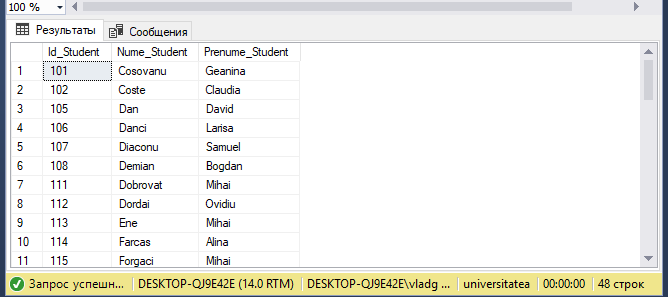

**30.** [Code:](Scripts/Lab4_Task30.sql)

```javascript
SELECT COUNT(DISTINCT st_r.Id_Student) as 'Nr. Students', ROUND(AVG(CAST(st_r.Nota as float)) * 100, 0) / 100 as 'AVG'
FROM studenti_reusita as st_r INNER JOIN discipline as d
	ON st_r.Id_Disciplina = d.Id_Disciplina
WHERE  Tip_Evaluare LIKE 'Reusita%' and (YEAR(st_r.Data_Evaluare) = 2018 or YEAR(st_r.Data_Evaluare) = 2019)
```

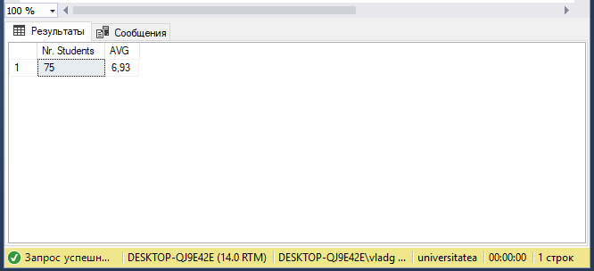

**31.** [Code:](Scripts/Lab4_Task31.sql)

```javascript
SELECT DISTINCT Nume_Student, Prenume_Student
FROM (SELECT DISTINCT d.Id_Disciplina, st.Nume_Student, st.Prenume_Student
	 FROM (studenti as st INNER JOIN studenti_reusita as st_r
  		ON st.Id_Student = st_r.Id_Student) INNER JOIN discipline as d
		ON st_r.Id_Disciplina = d.Id_Disciplina
	 WHERE st_r.Nota < 5
	 GROUP BY d.Id_Disciplina, st.Nume_Student, st.Prenume_Student
	 HAVING COUNT(st_r.Nota) > 2) as tmp
```

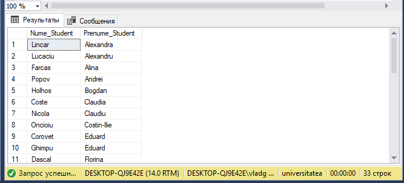

**32.** [Code:](Scripts/Lab4_Task32.sql)

```javascript
SELECT g.Cod_Grupa, st.Nume_Student, st.Prenume_Student, ROUND(AVG(CAST(st_r.Nota as float)) * 100, 0) / 100 as 'Final Note'
FROM (studenti as st INNER JOIN studenti_reusita as st_r
	ON st.Id_Student = st_r.Id_Student) INNER JOIN grupe as g
	ON st_r.Id_Grupa = g.Id_Grupa
WHERE Tip_Evaluare LIKE 'Reusita%'
GROUP BY g.Cod_Grupa, st.Nume_Student, st.Prenume_Student
```

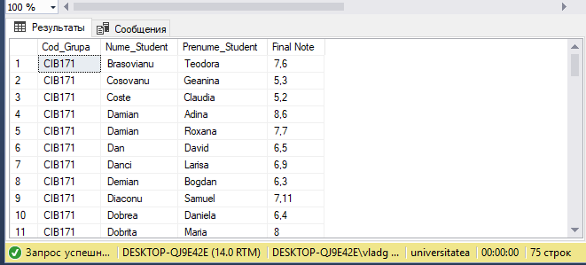

**33.** [Code:](Scripts/Lab4_Task33.sql)

```javascript
SELECT tmp.Id_Student
FROM (SELECT st.Id_Student, d.Id_Disciplina
	FROM (studenti as st INNER JOIN studenti_reusita as st_r
		ON st.Id_Student = st_r.Id_Student) INNER JOIN discipline as d
		ON st_r.Id_Disciplina = d.Id_Disciplina
	WHERE st_r.Nota < 5 and st_r.Tip_Evaluare LIKE 'Reusita%'
	GROUP BY st.Id_Student, d.Id_Disciplina) as tmp
WHERE NOT EXISTS
	(SELECT stud_r.Id_Student
	FROM studenti_reusita as stud_r
	WHERE tmp.Id_Student = stud_r.Id_Student and stud_r.Tip_Evaluare LIKE 'Reusita%' and stud_r.Nota > 4)
```

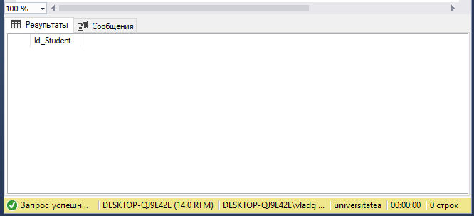

**34.** [Code:](Scripts/Lab4_Task34.sql)

```javascript
SELECT DISTINCT tmp.Id_Student
FROM (SELECT DISTINCT st.Id_Student, d.Id_Disciplina
	FROM (studenti as st INNER JOIN studenti_reusita as st_r
		ON st.Id_Student = st_r.Id_Student) INNER JOIN discipline as d
		ON st_r.Id_Disciplina = d.Id_Disciplina
	WHERE st_r.Nota < 5) as tmp
WHERE NOT EXISTS
	(SELECT st_r.Id_Student, d.Id_Disciplina
	FROM studenti_reusita as st_r INNER JOIN discipline as d
		ON st_r.Id_Disciplina = d.Id_Disciplina
	WHERE tmp.Id_Student = st_r.Id_Student and st_r.Nota > 4
	GROUP BY st_r.Id_Student, d.Id_Disciplina
	HAVING COUNT(st_r.Id_Student) = 4)
```


**35.** [Code:](Scripts/Lab4_Task35.sql)

```javascript
SELECT di.Disciplina, ROUND(tmp.AVG * 100, 0) / 100 as 'Average Note'
FROM (SELECT d.Id_Disciplina, AVG(CAST(st_r.Nota as float)) as 'AVG'
	FROM studenti_reusita as st_r INNER JOIN discipline as d
		ON st_r.Id_Disciplina = d.Id_Disciplina
	WHERE st_r.Tip_Evaluare LIKE '%Reusita%'
	GROUP BY d.Id_Disciplina) as tmp INNER JOIN discipline as di
	ON tmp.Id_Disciplina = di.Id_Disciplina
WHERE tmp.AVG > 7
```

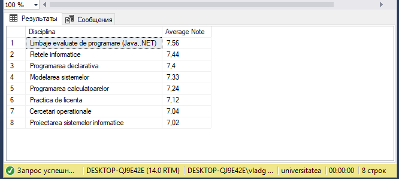

**36.** [Code:](Scripts/Lab4_Test36.sql)

```javascript
SELECT *
FROM (SELECT s.Nume_Student as 'NUME', s.Prenume_Student as 'PRENUME', tmp2.ANS as Town, tmp2.N as 'Nr. of Citizens' , 'STUDENT' as WORK
	FROM studenti as s,
		(SELECT tmp.ANS, (SELECT COUNT(st1.Id_Student)
						FROM studenti as st1
						WHERE st1.Adresa_Postala_Student LIKE tmp.ANS + '%')
						+
						(SELECT  COUNT(p1.Id_Profesor)
						FROM profesori as p1
						WHERE p1.Adresa_Postala_Profesor LIKE tmp.ANS + '%') as N
		FROM (SELECT st.Adresa_Postala_Student as _ADDRESS, SUBSTRING(st.Adresa_Postala_Student, 0, 11) as ANS
			FROM studenti as st
			GROUP BY st.Adresa_Postala_Student
			HAVING st.Adresa_Postala_Student LIKE SUBSTRING(st.Adresa_Postala_Student, 0, 11) + '%'

			UNION

			SELECT p.Adresa_Postala_Profesor as _ADDRESS, SUBSTRING(p.Adresa_Postala_Profesor, 0, 11) as ANS
			FROM profesori as p
			GROUP BY p.Adresa_Postala_Profesor
			HAVING p.Adresa_Postala_Profesor LIKE SUBSTRING(p.Adresa_Postala_Profesor, 0, 11) + '%') as tmp
		GROUP BY tmp.ANS) as tmp2
	WHERE s.Adresa_Postala_Student LIKE tmp2.ANS + '%'

	UNION

	SELECT prof.Nume_Profesor as 'NUME', prof.Prenume_Profesor as 'PRENUME', tmp2.ANS as Town, tmp2.N as 'Nr. of Citizens', 'PROFESOR' as WORK
	FROM profesori as prof,
		(SELECT tmp.ANS, (SELECT COUNT(st1.Id_Student)
						FROM studenti as st1
						WHERE st1.Adresa_Postala_Student LIKE tmp.ANS + '%')
						+
						(SELECT  COUNT(p1.Id_Profesor)
						FROM profesori as p1
						WHERE p1.Adresa_Postala_Profesor LIKE tmp.ANS + '%') as N
		FROM (SELECT st.Adresa_Postala_Student as _ADDRESS, SUBSTRING(st.Adresa_Postala_Student, 0, 11) as ANS
			FROM studenti as st
			GROUP BY st.Adresa_Postala_Student
			HAVING st.Adresa_Postala_Student LIKE SUBSTRING(st.Adresa_Postala_Student, 0, 11) + '%'

			UNION

			SELECT p.Adresa_Postala_Profesor as _ADDRESS, SUBSTRING(p.Adresa_Postala_Profesor, 0, 11) as ANS
			FROM profesori as p
			GROUP BY p.Adresa_Postala_Profesor
			HAVING p.Adresa_Postala_Profesor LIKE SUBSTRING(p.Adresa_Postala_Profesor, 0, 11) + '%') as tmp
		GROUP BY tmp.ANS) as tmp2
	WHERE prof.Adresa_Postala_Profesor LIKE tmp2.ANS + '%') as final
ORDER BY final.[Nr. of Citizens] DESC
```

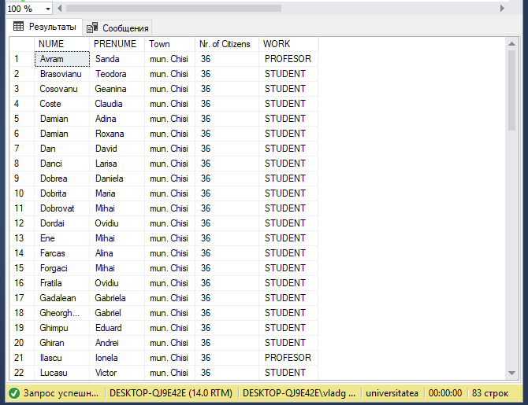

**37.** [Code:](Scripts/Lab4_Test37.sql)

```javascript
SELECT final.Disciplina , ROUND(final.[AVG] * 100, 0) / 100 as 'Nota medie Examen'
FROM (SELECT TOP(1) d.Id_Disciplina, d.Disciplina, AVG(CAST(st_r.Nota as float)) as 'AVG'
	FROM studenti_reusita as st_r INNER JOIN discipline as d
		ON st_r.Id_Disciplina = d.Id_Disciplina
	WHERE st_r.Tip_Evaluare = 'Examen'
	GROUP BY d.Id_Disciplina, d.Disciplina
	ORDER BY [AVG] DESC) as final
```

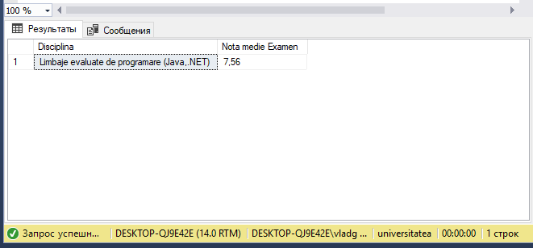

**38.** [Code:](Scripts/Lab4_Test38.sql)

```javascript
SELECT final.Disciplina, ROUND(final.AVG * 100, 0) / 100 as 'Average Note'
FROM (SELECT d.Id_Disciplina, d.Disciplina, AVG(CAST(st_r.Nota as float)) as 'AVG'
	FROM discipline as d INNER JOIN studenti_reusita as st_r
		ON d.Id_Disciplina = st_r.Id_Disciplina
	GROUP BY d.Id_Disciplina, d.Disciplina
	HAVING AVG(CAST(st_r.Nota as float)) >
		(SELECT AVG(CAST(st_r1.Nota as float))
		FROM discipline as di INNER JOIN studenti_reusita as st_r1
			ON di.Id_Disciplina = st_r1.Id_Disciplina
		WHERE di.Disciplina = 'Baze de date')) as final
```

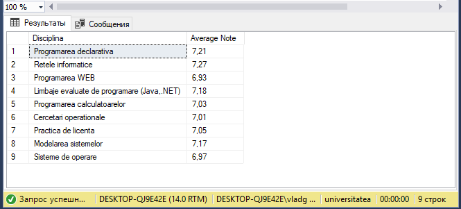

**39.** [Code:](Scripts/Lab4_Task39.sql)

```javascript
SELECT final.Disciplina, final.[Fail %]
FROM (SELECT d.Id_Disciplina, d.Disciplina,
										ROUND((SELECT CAST(COUNT(d1.Id_Disciplina) as float)
				FROM discipline as d1 INNER JOIN studenti_reusita as st_r1
					ON d1.Id_Disciplina = st_r1.Id_Disciplina
				WHERE d.Id_Disciplina = st_r1.Id_Disciplina and st_r1.Nota < 5 and st_r1.Tip_Evaluare LIKE 'Reusita%')  / (SELECT CAST(COUNT(d2.Id_Disciplina) as float)
																				FROM discipline as d2 INNER JOIN studenti_reusita as st_r2
																					ON d2.Id_Disciplina = st_r2.Id_Disciplina
																				WHERE d.Id_Disciplina = st_r2.Id_Disciplina and st_r2.Tip_Evaluare LIKE 'Reusita%') * 10000, 0) / 100 as 'Fail %'
FROM discipline as d INNER JOIN studenti_reusita as st_r
	ON d.Id_Disciplina = st_r.Id_Disciplina
WHERE st_r.Tip_Evaluare LIKE 'Reusita%'
GROUP BY d.Id_Disciplina, d.Disciplina
HAVING 
			(SELECT CAST(COUNT(d1.Id_Disciplina) as float)
			FROM discipline as d1 INNER JOIN studenti_reusita as st_r1
				ON d1.Id_Disciplina = st_r1.Id_Disciplina
			WHERE d.Id_Disciplina = st_r1.Id_Disciplina and st_r1.Nota < 5 and st_r1.Tip_Evaluare LIKE 'Reusita%')  / (SELECT CAST(COUNT(d2.Id_Disciplina) as float)
																			FROM discipline as d2 INNER JOIN studenti_reusita as st_r2
																				ON d2.Id_Disciplina = st_r2.Id_Disciplina
																			WHERE d.Id_Disciplina = st_r2.Id_Disciplina and st_r2.Tip_Evaluare LIKE 'Reusita%') > 0.05) as final
ORDER BY final.[Fail %] DESC
```

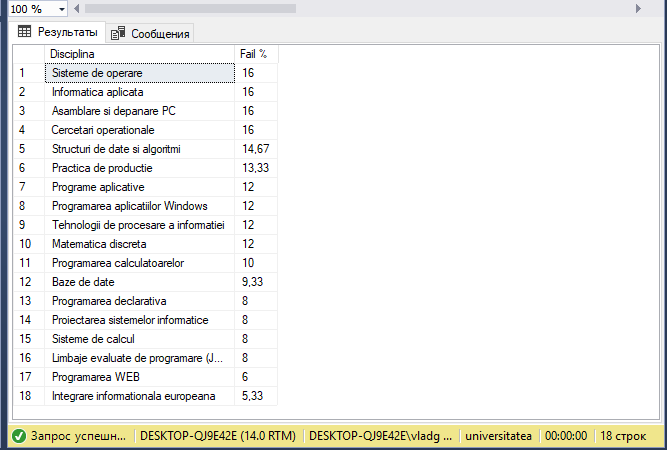
