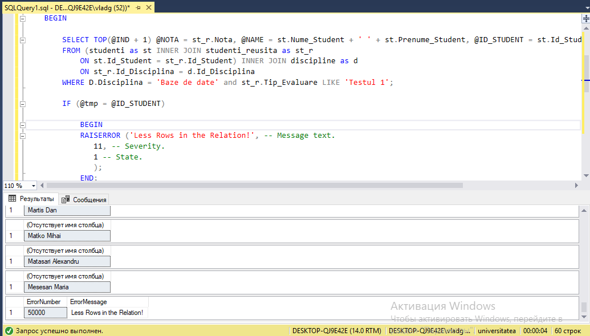

# Tasks


# Solutions

1. [Code:](Scripts/Lab5_Task1.sql)

```javascript
DECLARE @N1 INT, @N2 INT, @N3 INT;
DECLARE @MAI_MARE INT;
SET @N1 = 60 * RAND();
SET @N2 = 60 * RAND();
SET @N3 = 60 * RAND();

SET @MAI_MARE = @N1;
IF (@MAI_MARE < @N2)
BEGIN
	SET @MAI_MARE = @N2;
END
IF (@MAI_MARE < @N3)
BEGIN
	SET @MAI_MARE = @N3;
END	

PRINT @N1;
PRINT @N2;
PRINT @N3;
PRINT 'Mai mare = ' + CAST(@MAI_MARE AS VARCHAR(2));
```


2. [Code:](Scripts/Lab5_Task2.sql)

```javascript
Use universitatea
Go

DECLARE @NOTA INT = 0, @IND INT = 0, @FOUND INT = 0, @NAME NVARCHAR(20) = '';


WHILE (@FOUND < 10)
BEGIN
	
	SELECT TOP(@IND + 1) @NOTA = st_r.Nota, @NAME = st.Nume_Student + ' ' + st.Prenume_Student
	FROM (studenti as st INNER JOIN studenti_reusita as st_r
		ON st.Id_Student = st_r.Id_Student) INNER JOIN discipline as d
		ON st_r.Id_Disciplina = d.Id_Disciplina
	WHERE D.Disciplina = 'Baze de date' and st_r.Tip_Evaluare LIKE 'Testul 1';

	IF (@NOTA <> 6 and @NOTA <> 8)
	BEGIN
		SELECT @NAME;
		SET @FOUND = @FOUND + 1;
	END; 
	SET @IND = @IND + 1;
END;

```


3. [Code:](Scripts/Lab5_Task3.sql)

```javascript
DECLARE @N1 INT, @N2 INT, @N3 INT;
DECLARE @MAI_MARE INT;
SET @N1 = 60 * RAND();
SET @N2 = 60 * RAND();
SET @N3 = 60 * RAND();

SET @MAI_MARE = @N1
SET @MAI_MARE = CASE   
    WHEN @N2 > @MAI_MARE THEN @N2
	ELSE @MAI_MARE
END;
SET @MAI_MARE = CASE   
    WHEN @N3 > @MAI_MARE THEN @N3
	ELSE @MAI_MARE
END;

PRINT @N1;
PRINT @N2;
PRINT @N3;
PRINT 'Mai mare = ' + CAST(@MAI_MARE AS VARCHAR(2));
```


4. [Code:](Scripts/Lab5_Task4.sql)

```javascript
Use universitatea
Go

DECLARE @NOTA INT = 0, @IND INT = 0, @FOUND INT = 0, @NAME NVARCHAR(20) = '', @ID_STUDENT INT = 0;

DECLARE @tmp INT = -1;

BEGIN TRY  
    WHILE (@FOUND < 100)
	BEGIN

		SELECT TOP(@IND + 1) @NOTA = st_r.Nota, @NAME = st.Nume_Student + ' ' + st.Prenume_Student, @ID_STUDENT = st.Id_Student
		FROM (studenti as st INNER JOIN studenti_reusita as st_r
			ON st.Id_Student = st_r.Id_Student) INNER JOIN discipline as d
			ON st_r.Id_Disciplina = d.Id_Disciplina
		WHERE D.Disciplina = 'Baze de date' and st_r.Tip_Evaluare LIKE 'Testul 1';
		
		IF (@tmp = @ID_STUDENT)
		 
			BEGIN
			RAISERROR ('Less Rows in the Relation!', -- Message text.  
               11, -- Severity.  
               1 -- State.  
               );  
			END;
		SET @tmp = @ID_STUDENT;

		IF (@NOTA <> 6 and @NOTA <> 8)
		BEGIN
			SELECT @NAME;
			SET @FOUND = @FOUND + 1;
		END; 
		SET @IND = @IND + 1; 

END;  
END TRY  
BEGIN CATCH  
    SELECT   
        ERROR_NUMBER() AS ErrorNumber  
       ,ERROR_MESSAGE() AS ErrorMessage;  
END CATCH 
```



