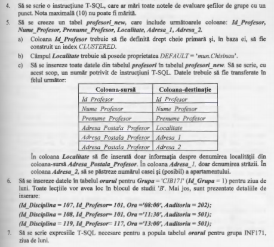

# Tasks





# Solutions

**1.** [Code:](Scripts/Lab6_Task1.sql)
```SQL
Use universitatea
Go

UPDATE profesori
SET Adresa_Postala_Profesor = 'mun. Chisinau'
WHERE Adresa_Postala_Profesor IS NULL
```


**2.** [Code:](Scripts/Lab6_Task2.sql)
```SQL
Use universitatea
Go

ALTER TABLE grupe
	ADD CONSTRAINT unique_field UNIQUE(Cod_Grupa)    
```


**3.** [Code:](Scripts/Lab6_Task3.sql)
```SQL
Use universitatea
Go

ALTER TABLE grupe
	ADD Sef_grupa INT NOT NULL CONSTRAINT def_negative1 DEFAULT(-1), 
		Prof_Indrumator INT NOT NULL CONSTRAINT def_negative2 DEFAULT(-1);


UPDATE grupe
	SET Sef_grupa = -1
WHERE Sef_grupa > -1;

DECLARE @ITERATOR INT = 0, @grupeSize INT = 0;

SELECT @grupeSize = COUNT(grupe.Id_Grupa)
FROM grupe;

WHILE(@ITERATOR < @grupeSize)
BEGIN

	DECLARE @ID_GRUPA INT = 0;
	SELECT TOP(@ITERATOR + 1) @ID_GRUPA = grupe.Id_Grupa
	FROM grupe;

	UPDATE grupe
	SET Sef_grupa = 
		(SELECT TOP(1) final.Id_Student
		FROM (SELECT st_r.Id_Student
			FROM studenti_reusita as st_r
			WHERE st_r.Id_Grupa = @ID_GRUPA 
			GROUP BY st_r.Id_Student, st_r.Id_Grupa
			HAVING st_r.Id_Student NOT IN
				(SELECT g.Sef_grupa
				FROM grupe as g)
			AND AVG(CAST(st_r.Nota as float)) = 
				(SELECT max(tmp.MAXI)
				FROM (SELECT AVG(CAST(stude_r.Nota as float)) as 'MAXI', stude_r.Id_Student
						FROM studenti_reusita as stude_r
						WHERE stude_r.Id_Grupa = @ID_GRUPA
						GROUP BY stude_r.Id_Student) as tmp
				)
			) as final
		)
	WHERE grupe.Sef_grupa < 0 and grupe.Id_Grupa = @ID_GRUPA;


	UPDATE grupe
	SET Prof_Indrumator = 
		(SELECT TOP(1) final.Id_Profesor
		FROM (SELECT st_r.Id_Profesor
			FROM studenti_reusita as st_r
			WHERE st_r.Id_Grupa = @ID_GRUPA 
			GROUP BY st_r.Id_Profesor
			HAVING st_r.Id_Profesor NOT IN
				(SELECT g.Prof_Indrumator
				FROM grupe as g)
			AND COUNT(st_r.Id_Disciplina) = 
				(SELECT max(tmp.MAXI)
				FROM (SELECT COUNT(stude_r.Id_Disciplina) as 'MAXI', stude_r.Id_Profesor
						FROM studenti_reusita as stude_r
						WHERE stude_r.Id_Grupa = @ID_GRUPA
						GROUP BY stude_r.Id_Profesor) as tmp
				)
			) as final
		)
	WHERE grupe.Prof_Indrumator < 0 and grupe.Id_Grupa = @ID_GRUPA;


	SET @ITERATOR = @ITERATOR + 1;

END
```


**4.** [Code:](Scripts/Lab6_Task4.sql)
```SQL
Use universitatea
Go

UPDATE studenti_reusita
SET Nota = Nota + 1
WHERE Nota < 10 and Id_Student IN
	(SELECT g.Sef_grupa
	FROM grupe as g)   
```


**5.** [Code:](Scripts/Lab6_Task5.sql)
```SQL
Use universitatea
Go

DROP TABLE IF EXISTS profesori_new;

CREATE TABLE profesori_new
(
    Id_Profesor INT PRIMARY KEY CLUSTERED,
    Nume_Profesor VARCHAR(60) NOT NULL,
    Prenume_Profesor VARCHAR(60) NOT NULL,
    Localitatea VARCHAR(255) DEFAULT 'mun.Chisinau',
    Adresa_1 VARCHAR(255),
    Adresa_2 VARCHAR(255),
);

DECLARE @tmp CURSOR;

SET @tmp = CURSOR FOR 
	SELECT p.Id_Profesor
	FROM cadre_didactice.profesori as p;

DECLARE @Id_profesor INT;
OPEN @tmp FETCH NEXT 
	FROM @tmp INTO @Id_profesor;

WHILE @@FETCH_STATUS = 0
BEGIN
    DECLARE @adresa_postala VARCHAR(255);
    DECLARE @localitatea VARCHAR(255);
    DECLARE @adresa1 VARCHAR(255);
    DECLARE @adresa2 VARCHAR(255);

    DECLARE @street INT;
    DECLARE @house INT;


    SELECT @adresa_postala = p.Adresa_Postala_Profesor
	FROM cadre_didactice.profesori as p
	WHERE p.Id_Profesor = @Id_profesor;

    SET @street = CHARINDEX('bd.', @adresa_postala);
    if (@street = 0) SET @street = CHARINDEX('str.', @adresa_postala);
    if (@street = 0) SET @street = 255;

    SET @house = PATINDEX('%[0-9]%', @adresa_postala);
    if (@house = 0) SET @house = 255;
    
    SET @localitatea = SUBSTRING(@adresa_postala, 0, @street - 2);
    SET @adresa1 = SUBSTRING(@adresa_postala, @street, IIF (@house - @street - 1 >= 0 , @house - @street - 2, 0));
    SET @adresa2 = SUBSTRING(@adresa_postala, @house, 255 - @house);

    if (@localitatea LIKE '') SET @localitatea = NULL;
    if (@adresa1 LIKE '') SET @adresa1 = NULL;
    if (@adresa2 LIKE '') SET @adresa2 = NULL;

    INSERT INTO profesori_new
    SELECT
        p.Id_Profesor,
        p.Nume_Profesor,
        p.Prenume_Profesor,
        @localitatea AS Localitatea,
        @adresa1 AS Adresa_1,
        @adresa2 AS Adresa_2
    FROM cadre_didactice.profesori as p
    WHERE p.Id_Profesor = @Id_profesor;

    FETCH NEXT FROM @tmp INTO @Id_profesor;
END;
```


**6.** [Code:](Scripts/Lab6_Task6.sql)
```SQL
Use universitatea
Go

DROP TABLE IF EXISTS orarul;

CREATE TABLE orarul (
	Id_Disciplina INT NOT NULL,
	Id_Profesor INT,
	Id_Grupa SMALLINT,
	Zi CHAR(2) DEFAULT('Mo'),
	Ora TIME DEFAULT('08:00'),
	Auditoriu INT DEFAULT('101'),
	Bloc CHAR(1) NOT NULL DEFAULT('B'),
	PRIMARY KEY (Id_Grupa, Zi, Ora, Auditoriu)
);

INSERT INTO orarul (Id_Grupa, Id_Disciplina, Id_Profesor, Ora, Auditoriu)
VALUES  (1, 107, 101, '08:00', 202),
		(1, 108, 101, '11:30', 501),
		(1, 119, 117, '13:00', 501);

		-- 7

	DECLARE @ID_INF171 SMALLINT = -1;

 SELECT @ID_INF171 = g.Id_Grupa
 FROM grupe as g
 WHERE g.Cod_Grupa = 'INF171';
```


**7.** [Code:](Scripts/Lab6_Task7.sql)
```SQL
Use universitatea
Go

 DECLARE @ID_INF171 SMALLINT = -1;

 SELECT @ID_INF171 = g.Id_Grupa
 FROM grupe as g
 WHERE g.Cod_Grupa = 'INF171';


 -- #1 lecture
 DECLARE @ID_BIVOL_ION INT = -1;

 SELECT @ID_BIVOL_ION = p.Id_Profesor
 FROM profesori as p
 WHERE p.Nume_Profesor = 'Bivol' and p.Prenume_Profesor = 'Ion';

 DECLARE @ID_STRUCTURI_DE_DATE_SI_ALGORITMI INT = -1;

 SELECT @ID_STRUCTURI_DE_DATE_SI_ALGORITMI = d.Id_Disciplina
 FROM discipline as d
 WHERE d.Disciplina LIKE 'Structuri%'

 -- #2 lecture
 DECLARE @ID_PROGRAME_APLICATIVE INT = -1;
 
 SELECT @ID_PROGRAME_APLICATIVE = d.Id_Disciplina
 FROM discipline as d
 WHERE d.Disciplina = 'Programe aplicative'
 
 DECLARE @ID_MIRCEA_SORIN INT = -1;
 
 SELECT @ID_MIRCEA_SORIN = p.Id_Profesor
 FROM profesori as p
 WHERE p.Nume_Profesor = 'Mircea' and p.Prenume_Profesor = 'Sorin';

 -- #3 lecture
 DECLARE @ID_BAZE_DE_DATE INT = -1;
 
 SELECT @ID_BAZE_DE_DATE = d.Id_Disciplina
 FROM discipline as d
 WHERE d.Disciplina = 'Baze de date'
 
 DECLARE @ID_MICU_ELENA INT = -1;

 SELECT @ID_MICU_ELENA = p.Id_Profesor
 FROM profesori as p
 WHERE p.Nume_Profesor = 'Micu' and p.Prenume_Profesor = 'Elena';

-- INSERTING VALUES
 INSERT INTO orarul (Id_Grupa, Id_Disciplina, Id_Profesor, Ora)
 VALUES (@ID_INF171, @ID_STRUCTURI_DE_DATE_SI_ALGORITMI, @ID_BIVOL_ION, '08:00'),
		(@ID_INF171, @ID_PROGRAME_APLICATIVE, @ID_MIRCEA_SORIN, '11:30'),
		(@ID_INF171, @ID_BAZE_DE_DATE, @ID_MICU_ELENA, '13:00'); 
```
