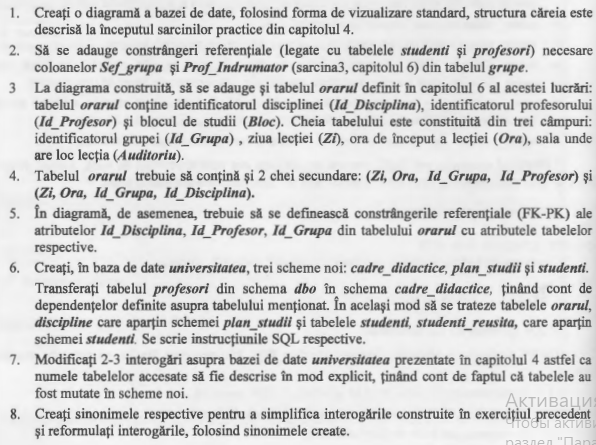
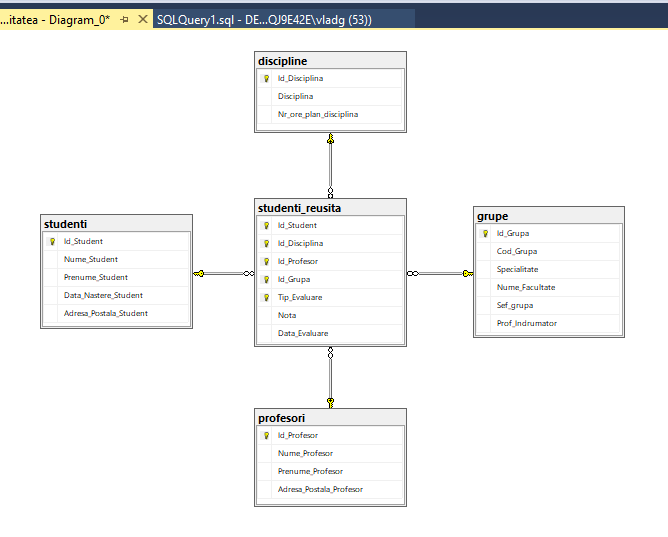
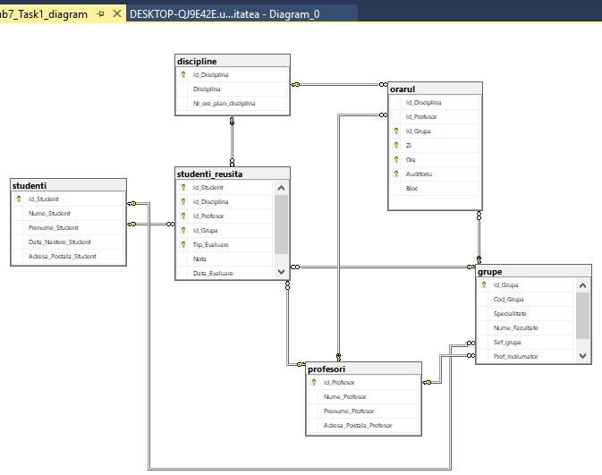
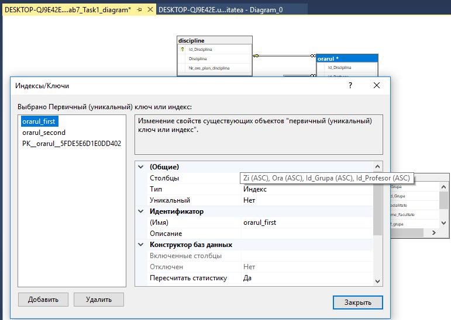
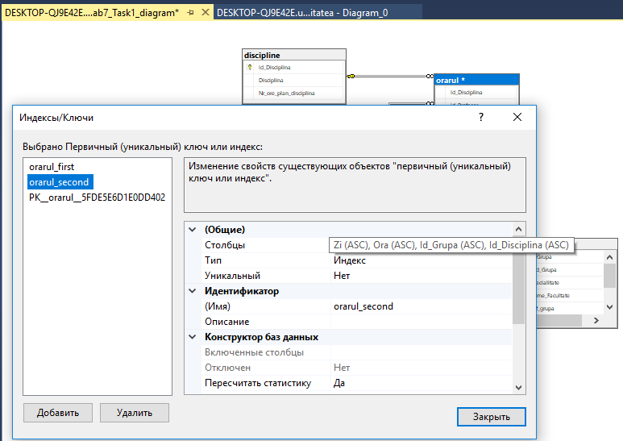
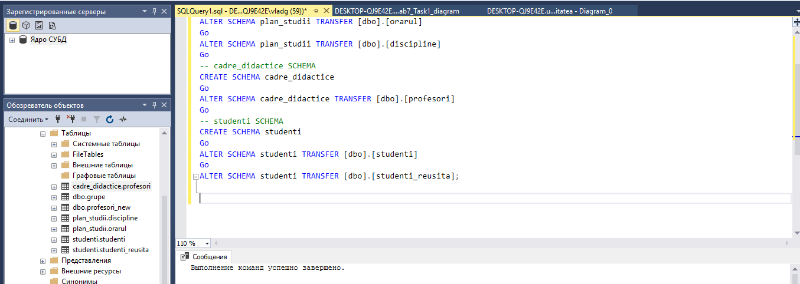

# Tasks



# Solutions

**1.** 

**2.** 

**3.** 

**4.** 


**5.** 

**6.** [Code:](Scripts/Lab7_Task6.sql)
```SQL
Use universitatea
Go

-- plan_studii SCHEMA
CREATE SCHEMA plan_studii
Go
ALTER SCHEMA plan_studii TRANSFER [dbo].[orarul]
Go
ALTER SCHEMA plan_studii TRANSFER [dbo].[discipline]
Go
-- cadre_didactice SCHEMA
CREATE SCHEMA cadre_didactice 
Go
ALTER SCHEMA cadre_didactice TRANSFER [dbo].[profesori]
Go
-- studenti SCHEMA
CREATE SCHEMA studenti
Go
ALTER SCHEMA studenti TRANSFER [dbo].[studenti]
Go
ALTER SCHEMA studenti TRANSFER [dbo].[studenti_reusita];

```


**7.** [Code:](Scripts/Lab7_Task7.sql)
```SQL

```


**8.** [Code:](Scripts/Lab7_Task8.sql)
```SQL

```
