# Tasks

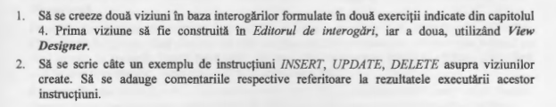

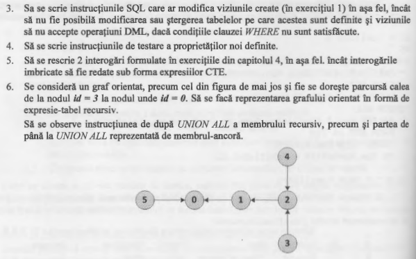

# Solutions

**1.** 

[Code:](Scripts/Lab8_Task1.sql)

[Code:](Scripts/Lab8_Task1_add.sql)

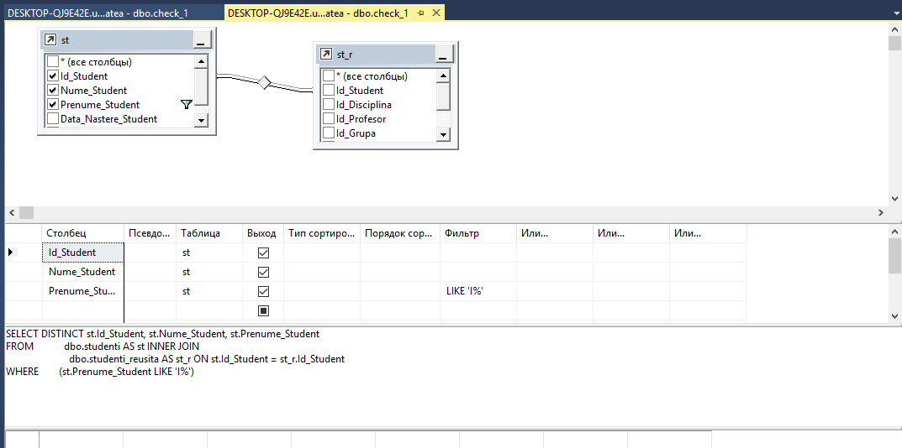
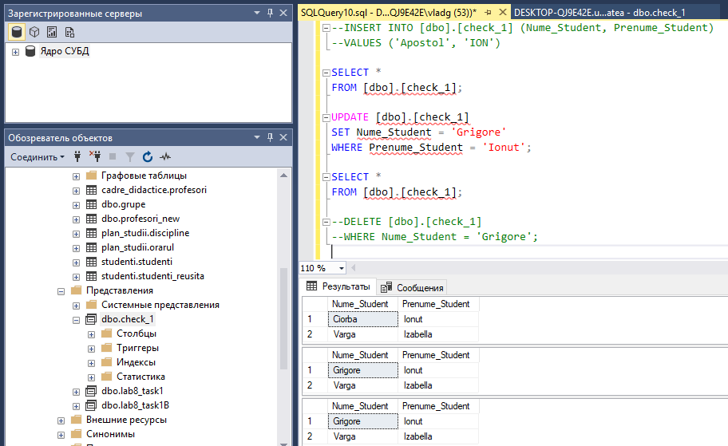
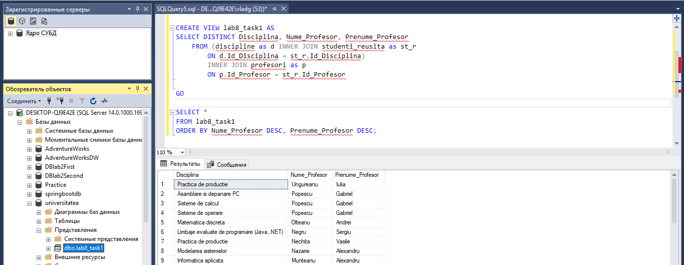
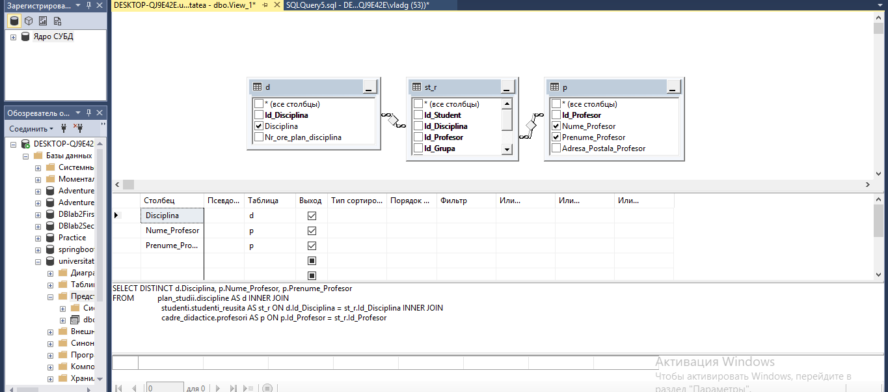
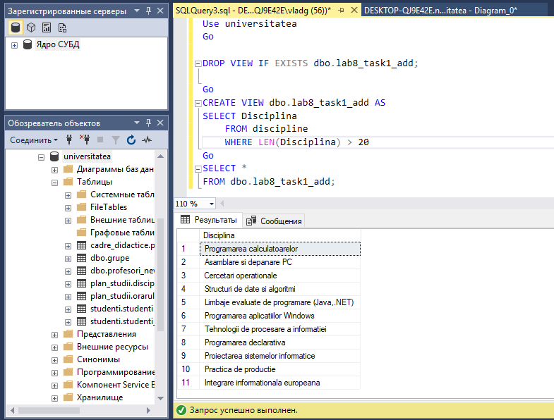

**2.**

[Code:](Scripts/Lab8_Task2__.sql)

[Code:](Scripts/Lab8_Task2_ans.sql)

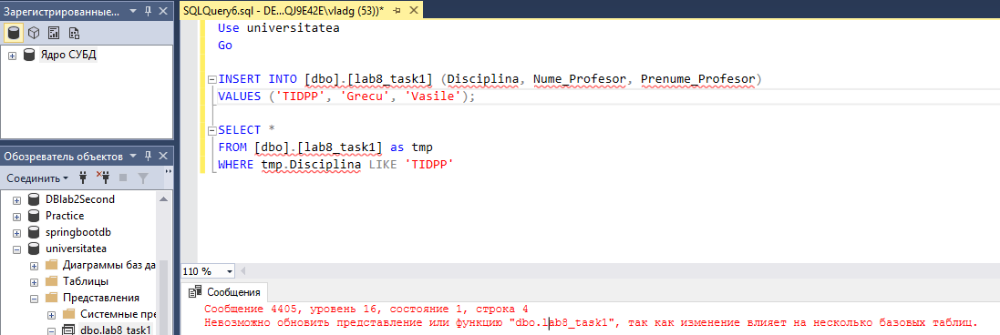

**3 - 4.**

[Code:](Scripts/Lab8_Task3.sql)

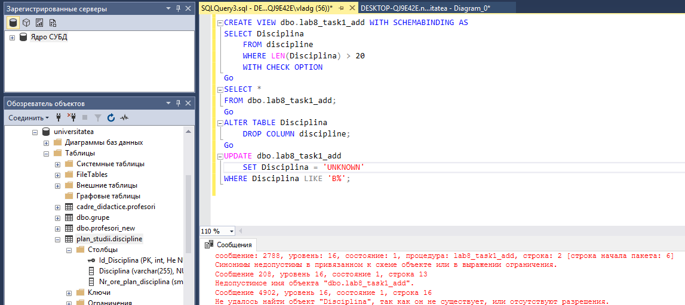

**5.**

[Code:](Scripts/Lab8_Task5A.sql)

[Code:](Scripts/Lab8_Task5B.sql)

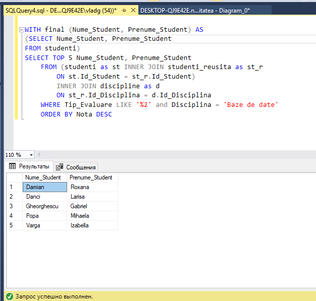

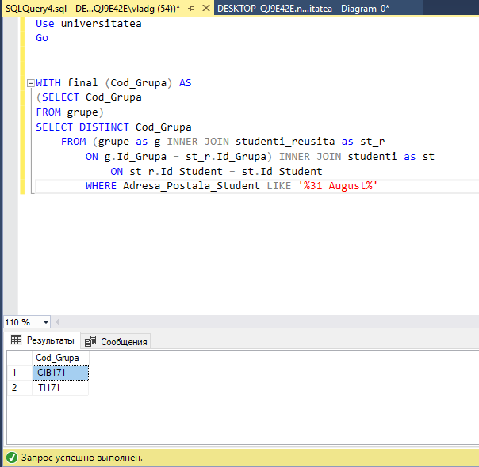

**6.**

[Code:](Scripts/Lab8_Task6.sql)

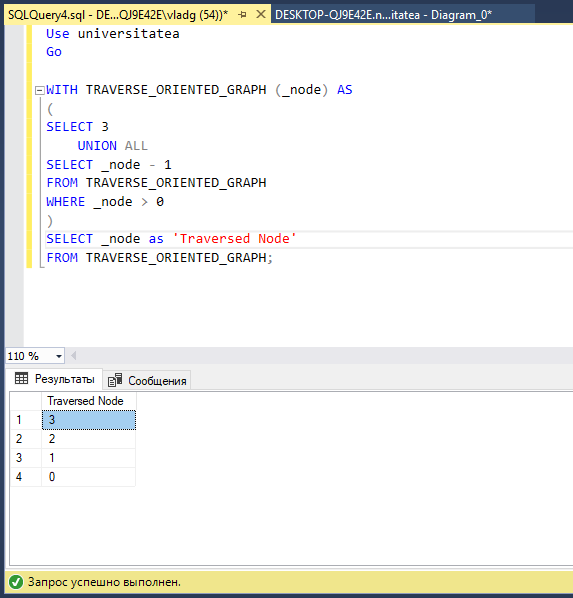
