# Tasks

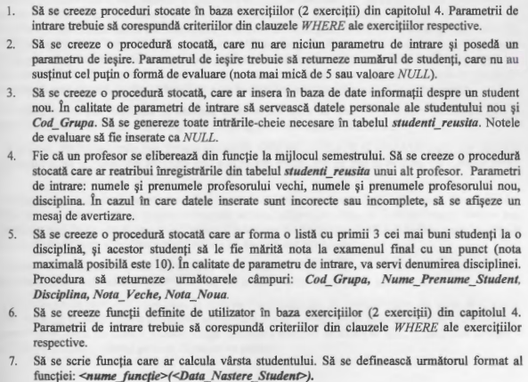

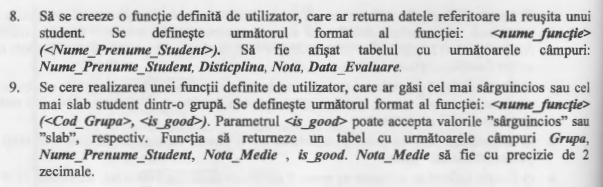

# Solution

**1.** [Code:](Scripts/LAB4_Q4.sql)

```SQL
Use universitatea
Go

DROP PROCEDURE IF EXISTS LAB4_Q4;

Go

CREATE PROCEDURE LAB4_Q4 
	@LENGTH INT = 1
AS
	SELECT Disciplina
    FROM discipline
    WHERE LEN(Disciplina) > @LENGTH;
```

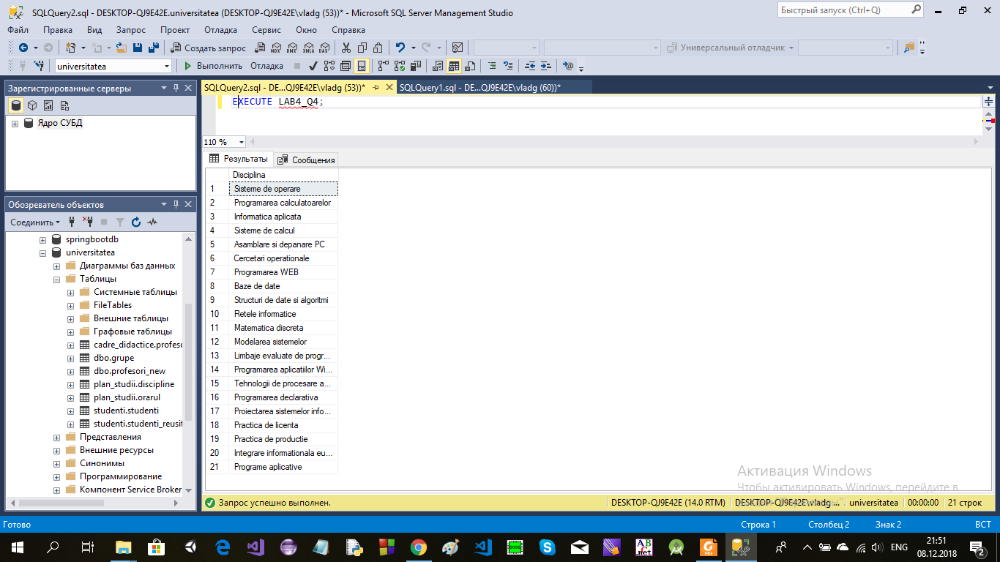

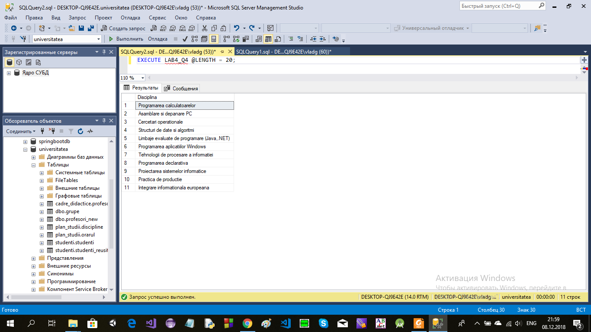

[Code:](Scripts/LAB4_Q5.sql)

```SQL
Use universitatea
Go

DROP PROCEDURE IF EXISTS LAB4_Q5;

Go

CREATE PROCEDURE LAB4_Q5
	@NAME VARCHAR(50) = NULL
AS
	IF @NAME IS NOT NULL
		BEGIN
		SELECT *
		FROM studenti
		WHERE Nume_Student LIKE @NAME
		END
	ELSE BEGIN
		SELECT *
		FROM studenti
	END;
```


**2.** [Code:](Scripts/Lab9_Task2.sql)

```SQL
Use universitatea
Go

DROP PROCEDURE IF EXISTS RESTANTA;
Go

CREATE PROCEDURE RESTANTA
	@RESTANTIERI INT = 0 OUTPUT
AS
	BEGIN
	(SELECT @RESTANTIERI = COUNT(DISTINCT Id_Student)
	FROM studenti_reusita as st_r
	WHERE Nota < 5 or Nota IS NULL)
	END
```

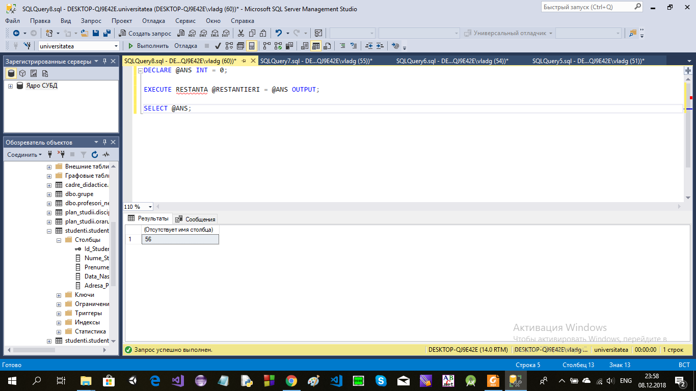

**3.** [Code:](Scripts/Lab9_Task3.sql)

```SQL
Use universitatea
Go

DROP PROCEDURE IF EXISTS NEW_STUDENT;
Go

CREATE PROCEDURE NEW_STUDENT
	@ID_STUDENT INT = 100,
	@NUME_STUDENT VARCHAR(50) = 'UNNAMED',
	@PRENUME_STUDENT VARCHAR(50) = 'UNNAMED',
	@DATA_NASTERE_STUDENT DATE = '1997-01-01',
	@ADRESA_POSTALA_STUDENT VARCHAR(500) = 'UNKNOWN',
	@COD_GRUPA VARCHAR(6) = 'FAF161',
	@SPECIALITATE VARCHAR(255) = 'Software Ingeneering',
	@FACULTATE varchar(255) = 'CIM',
	@ID_DISCIPLINA INT = 100,
	@ID_PROFESOR INT = 108,
	@TIP_EVALUARE VARCHAR(60) = 'Examen',
	@ID_GRUPA INT = 1
AS
	BEGIN
	DECLARE @POSSIBLE_ID INT = @ID_STUDENT;
	IF EXISTS (SELECT s.Id_Student
			FROM studenti AS s
			WHERE s.Id_Student = @ID_STUDENT)
	BEGIN
		SET @POSSIBLE_ID = 1 + (SELECT MAX(Id_Student) FROM studenti)
	END;

	INSERT INTO [dbo].[studenti_reusita] (Id_Student, Id_Grupa, Id_Profesor, Id_Disciplina, Tip_Evaluare)
	VALUES (@POSSIBLE_ID, @ID_GRUPA, @ID_PROFESOR, @ID_DISCIPLINA, @TIP_EVALUARE);
	
	END;
```

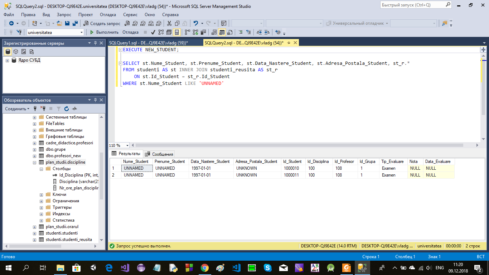

**4.** [Code:](Scripts/Lab9_Task4.sql)

```SQL
Use universitatea
Go

DROP PROCEDURE IF EXISTS ALT_PROFESOR;
Go

CREATE PROCEDURE ALT_PROFESOR
	@NUME_PROFESOR_VECHI VARCHAR(60),
	@PRENUME_PROFESOR_VECHI VARCHAR(60),
	@NUME_PROFESOR_NOU VARCHAR(60),
	@PRENUME_PROFESOR_NOU VARCHAR(60),
	@DISCIPLINA VARCHAR(255)
AS
	BEGIN
	BEGIN TRY
		
		DECLARE @OLD_PROFESOR_ID INT = (SELECT p.Id_Profesor
				FROM profesori AS p
				WHERE p.Nume_Profesor = @NUME_PROFESOR_VECHI AND p.Prenume_Profesor = @PRENUME_PROFESOR_VECHI);
		
		DECLARE @NEW_PROFESOR_ID INT = (SELECT p.Id_Profesor
				FROM profesori AS p
				WHERE p.Nume_Profesor = @NUME_PROFESOR_NOU AND p.Prenume_Profesor = @PRENUME_PROFESOR_NOU);

		DECLARE @DISCIPLINA_ID INT = (SELECT d.Id_Disciplina
				FROM discipline AS d
				WHERE d.Disciplina = @DISCIPLINA);

		IF @OLD_PROFESOR_ID IS NOT NULL AND @NEW_PROFESOR_ID IS NOT NULL AND @DISCIPLINA_ID IS NOT NULL
			BEGIN
				UPDATE studenti_reusita
				SET Id_Profesor = @NEW_PROFESOR_ID
				WHERE Id_Profesor = @OLD_PROFESOR_ID AND Id_Disciplina = @DISCIPLINA_ID
				RETURN;
			END
		RAISERROR ('INVALID INPUT DATA', -- Message text.  
					11, -- Severity.  
					1 -- State.  
					);
	END TRY
	BEGIN CATCH
		SELECT   
        ERROR_NUMBER() AS ErrorNumber  
       ,ERROR_MESSAGE() AS ErrorMessage;
	END CATCH
END;
```

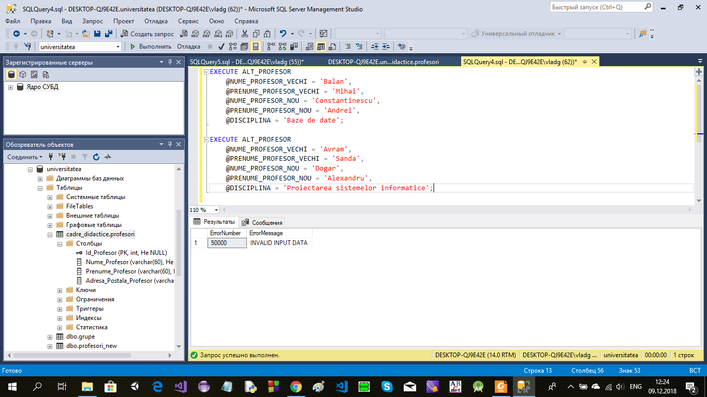

**5.** [Code:](Scripts/Lab9_Task5a.sql)

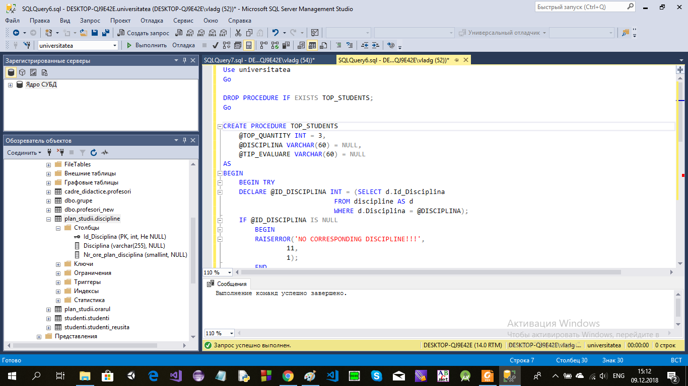

[Code:](Scripts/Lab9_Task5b.sql)

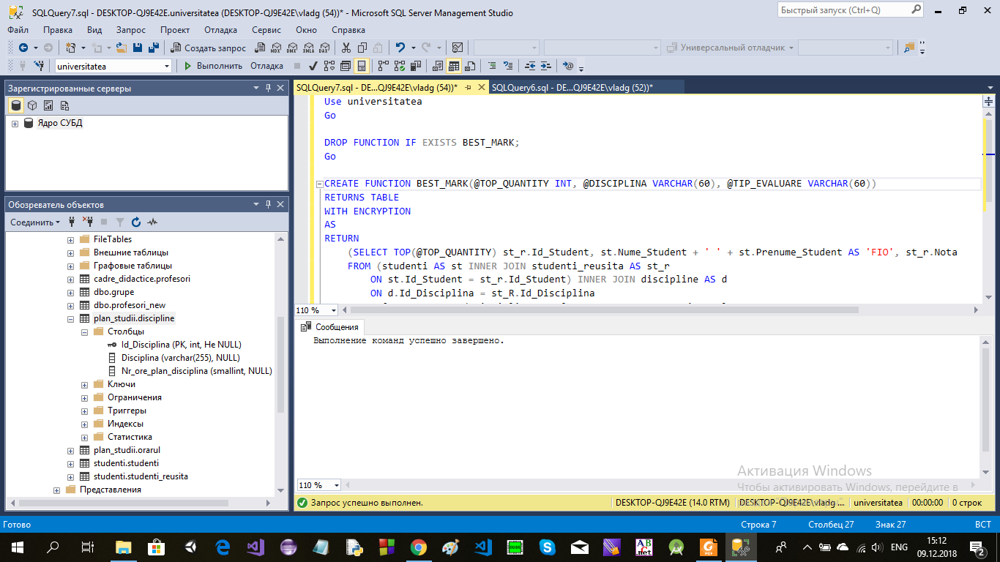

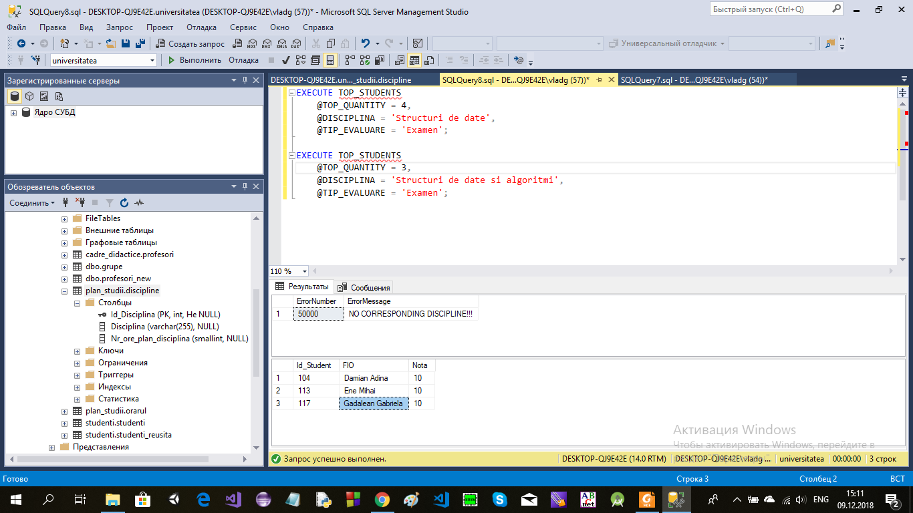

**6.**

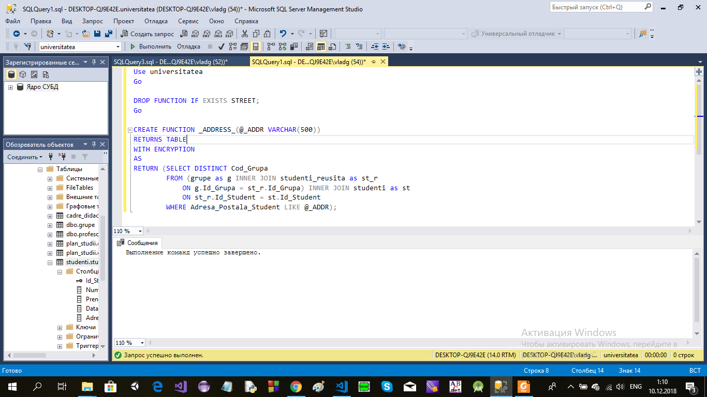

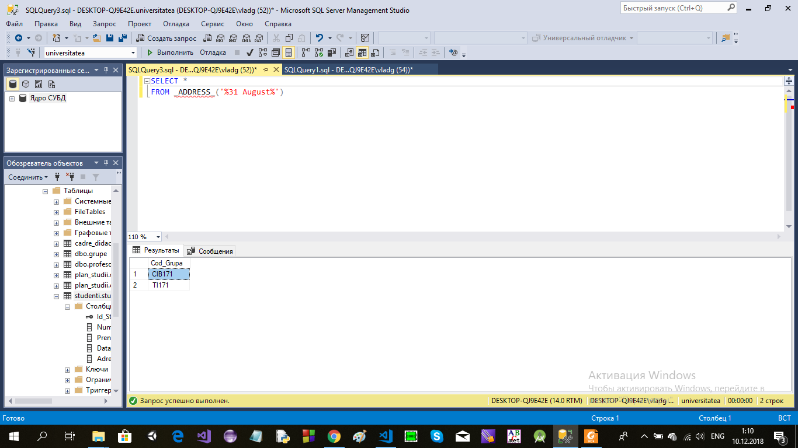

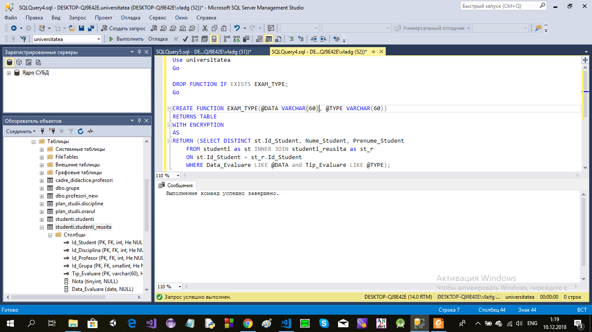

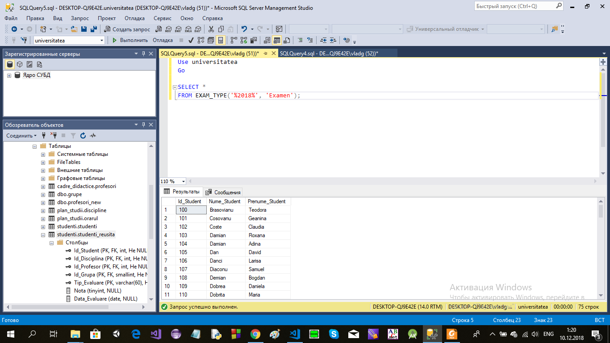

**7.** [Code:](Scripts/Lab9_Task7.sql)

```SQL
Use universitatea
Go

DROP FUNCTION IF EXISTS PERSON_AGE;
Go

CREATE FUNCTION PERSON_AGE(@DATE DATE = NULL)
RETURNS INT
AS
BEGIN
DECLARE @CURRENT_DATE DATE = GETDATE();
DECLARE @ANS INT = YEAR(@CURRENT_DATE) - YEAR(@DATE);
IF MONTH(@CURRENT_DATE) < MONTH(@DATE) OR  (MONTH(@CURRENT_DATE) = MONTH(@DATE) AND DAY(@CURRENT_DATE) < DAY(@DATE))
SET @ANS = @ANS - 1;
RETURN @ANS;
END; 
```

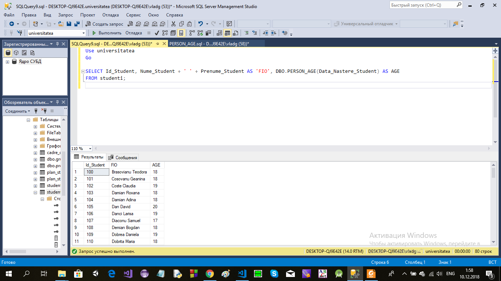

**8.** [Code:](Scripts/Lab9_Task8.sql)

```SQL
Use universitatea
Go

DROP FUNCTION IF EXISTS STUDENT_STATS;

Go
CREATE FUNCTION STUDENT_STATS(@FULL_NAME VARCHAR(120))
RETURNS TABLE
WITH ENCRYPTION
AS
RETURN (SELECT s.Id_Student, s.Nume_Student + ' ' + s.Prenume_Student AS 'NAME', d.Disciplina, st_r.Nota, st_r.Data_Evaluare
		FROM (studenti_reusita as st_r INNER JOIN studenti as s
			ON st_r.Id_Student = s.Id_Student) INNER JOIN discipline as d
			ON d.Id_Disciplina = st_r.Id_Disciplina
		WHERE s.Nume_Student + ' ' + s.Prenume_Student LIKE @FULL_NAME and Tip_Evaluare LIKE 'Reusita%'
		GROUP BY s.Id_Student, s.Nume_Student, s.Prenume_Student, d.Disciplina, st_r.Nota, st_r.Data_Evaluare);
```

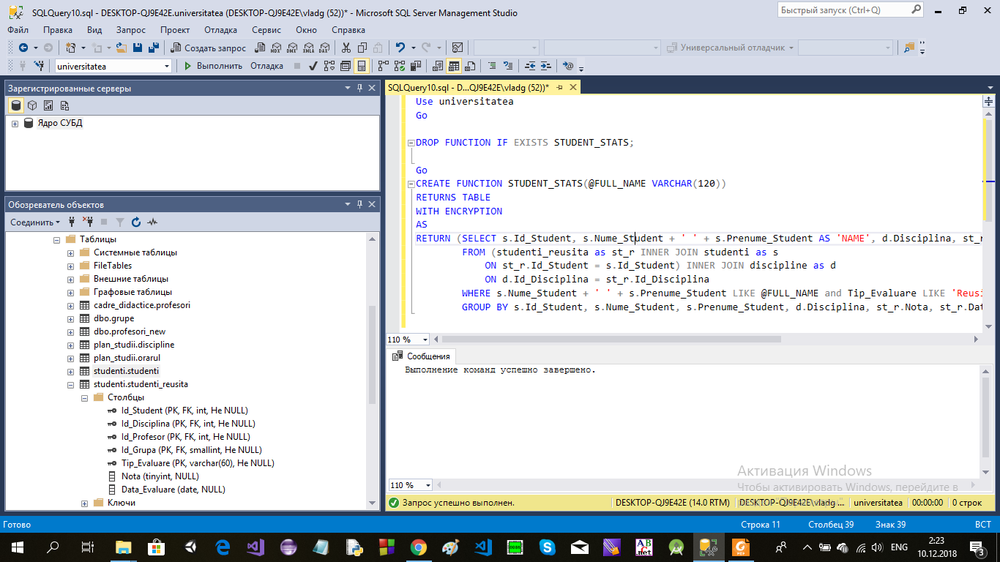

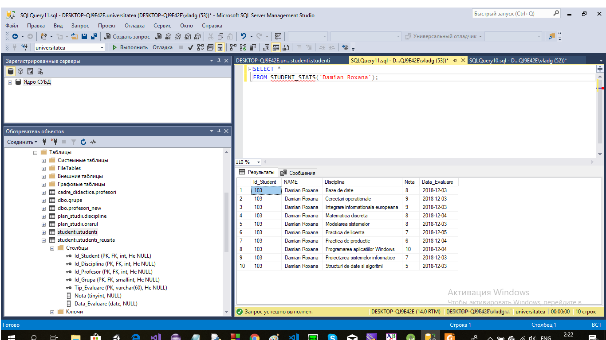